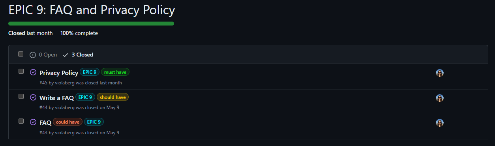

# **Agile Methodology**

## **Overview**

This project was created using Agile Methodology to split it in smaller tasks. To do so, I created user stories with acceptance criteria and grouped these into EPIC milestones so I can focus on one feature at the time. I decided against using sprints as my everyday availability can vary a lot.

### **EPIC**

In Agile tasks/user stories can be broken down into EPICS or Milestones. It's a helpful way to segment user stories based on needs/requests of end-users while working towards a fully functional project. 

I started project with setting due dates but as I had to edit those few times due to family life and health issues, I decided not to use due dates. While I had approximate idea when I should be done with certain features, I had to adjust to other duties so some days I could spend 10 hours for project when others only 1 or none. I very soon realised I would be either past due date or constantly changing those, so for this project there wasn't a real benefit for such.

#### **EPIC 1: Planning**

I found Epic 1 very creative and once again realised that frontend is definitely my favourite and probably strongest part too. This Epic took around a week to fullfill as I tried to plan ahead as much as possible.

* I struggled at the start with creating ERDs but once started, it went surprisingly fast and wasn't as hard as I remember from project 4.
* Wireframes was one of the first things I did during planning phase, as it gives a good planning base for me. While some changes might occur during development, they show great base for this project.
* As always I spent a good amount of time choosing colours and fonts and writing descriptions in Readme but it has always been one of my favourite parts of any project.
* I originally planned to make a flowchart but was told it's not needed so I decided not to go ahead.

EPIC 1

#### **EPIC 2: Setup and Deployment**

Epic 2 seemed completely opposite to Epic 1. I did farely well timewise, even though it was spread throughout all development time. I have noticed how much better I understand Bootstrap now, as I have used it in pp4 and few hackathons too. Loads to learn and grow but I finally started liking it.

* I created repository and set everything up while following Boutique Ado videos to ensure everything is correct.
* I was slightly worried about deploying to Heroku as usually it likes to throw errors and I have heard good few issues from people but luckily it has been good enough for me and easy to set up. Slight issues logging in from terminal but a quick slack search revealed I need to use <code>heroku login -i</code> and create API key to enter instead of password not <code>heroku login</code> as shown in walkthrough.
* I decided early on to use Bootstrap to help with responsiveness but it was one of the user stories I kept open during development to keep it as reminder to check if app is responsive.
* Error pages were made more towards the end of development but it was surprisingly easy and fast to create those.

EPIC 2

#### **EPIC 3: Admin and Store Management**

For this Epic I mostly follow Boutique Ado. It was straight forward and something I have become very familiar with during the last 2 projects.

* Creating superuser for admin was quick and easy. 
* Manipulation of products or in my case gemstones was spread out during development as I followed along walkthrough to create frontend login and forms for admin.

EPIC 3

#### **EPIC 4: Vieving and Navigating**

User stories for features in this epic gave me a lot of headache, especially wishlist. I decided not to have specials, clearance or deals as in real life scenario it wouldn't be very common to see discounts on loose gemstones. It only occurs to low quality stones mostly. I left new arrivals and rearranged my navbar accordingly. Overall, Epic 4 took a lot longer than I expected as I encountered issues.

* From very beginning I was planning to implement wishlist but after good few days of struggle to get it working, I was considering leaving it for future development. First I couldn't add gemstones to it, no matter what I tried but once it finally worked, I had a big relief. Only until I decided to check if and how it looks rendered on page. I had a separate wishlist template made but decided not to keep it as idea was to integrate wishlith into profile page. It took another couple of days to get it rendering.
* I had initially decided projet with fair amount on golden text on white background but as came accross contrast errors, I had to change my original plan. Now that I look at it, I like it better they way it is now.
* To implement purchase total I followed Boutique Adod walkthrough videos.

EPIC 4:

#### **EPIC 5: Sorting and Searching**

This epic took less than a day to implement fy following Boutique Ado walkthrough. Very straight forward to create but such important features for online shop. I discarded idea to implement multiple category sorting but due to limited time for project, I decided not to have it.

* Search for a gemstone, search results and sirting list was all developed following walkthrough and adjusting it to my project's needs.

EPIC 5

#### **EPIC 6: Registration and User Accounts**

For user registration and accounts I follow walkthrough. Additionally I developed my own personalized user profile. I struggled for a while to get tabs working properly and but with some help from mentor we managed to find an issue in my css and set so Delivery tab opens when User Profile is loaded.

* I decided to have hover tabs in user profile that took me a while to set up but I'm delighted with results.
* Originally I had an idea to have user image/ avatas in profile but after having it ready decided to discard it as it's not common to have user image for e-commerce shops. Might add it as feature in future when blog is added too so user can comment with set profile image if they like.

EPIC 6

#### **EPIC 7: Purchasing and Checkout**

For most of purchasing and checkout part of project I followed Boutique Ado with neccessary adjustments for my own project. It worked perfectly fine until some moment when I changed url, I still don't know why I did it and when but thanks to tutor support, it's all working now. I can't believe I kept re-checking that path over and over and didn't see a mistake but that's something 20 hour coding and 4 hour sleep for a week does to you (don't try this at home, not recommended).

* After starting project I decided to add order status as additional feature. It wasn't in my plan originally but I'm glad I went ahead with it as it was very straight forward and a great real life addition to e-commerce shop.
* I run into some errors with Stripe and webhook endpoints that I couldn't sort out myself more of a fear of breaking it completely few days before submission. Rebecca in tutor support very kindly helped me debug. I really liked her approach as she offered me to debug along with her. At the end it was a typo, nothing to do with Stripe setup as such.

EPIC 7

#### **EPIC 8: Contact**

This epic went very smoothly as I added contact details in footer, created contact page with form to send an email for any additional questions users might have. As one of my own models I created subscription form. I found it fairly easy to get it working and was very happy sending real emails worked.

* While Boutique Ado had subscription form as well, I created my own as I didn't like monkey on Mailchimp free option. It really wouldn't fit well into my project's design especially because my form is on Home page, rather than in footer.

EPIC 8

#### **EPIC 9: FAQ and Privacy Policy**

This epic's features very quick and easy to implement, especially because just before it, I created Frequently Asked Questions part for project in London's hackathon I participated in. I had a fair idea how I wanted it to look and function. For Privacy policy I used generator and created a simple page.

* After initial development of FAQ, I decided to change it slightly and instead of adding FAQ section as developer, I added it in admin's panel so in future anyone with access to it, can easily add more questions or update existing ones, if needed.

EPIC 9

#### **EPIC 10: Reviews and Ratings**

During planning I decided on reviews as my additional model but wasn't very confident in creating it as I had some struggles during pp4. I made a decision to add ratings and reviews for Bling It as shop rather than each gemstone for several reasons that I mentioned in README.md

* Luckily for me, this time implementing reviews wasn't as hard (now I know how to fix it in my pp4 too) and I really like review card design.

EPIC 10

### **USER STORIES**

A user story serves as an explanation how a certain feature will provide a value to a user. The help developer to understand what and why they are building to provide a better end product overall. Boutique Ado walkthrough user stories were used for part of this project and some adjusted to suit it better, with more user stories added by myself.

[All user stories can be found following this link to my Github repository](https://github.com/violaberg/bling-it/issues)

### **MoSCoW METHOD**

A MoSCoW Method is a popular prioritization technique used in many projects, not only software development. It uses a 4-step approach of "must-have", "should-have", "could-have" and "won't-have".

MoSCoW

### **GITHUB KANBAN BOARD**

Kanban board is one way how to provide a visual for project management, optimize workflow and increase efficiency. As it is my first time fully implementing Kanban board, ups and downs and some inaccuracy was expected.

Github Kanban

## **Conclusion**

 As my experience grows using Agile, I found it much easier and less messy (or not at some points during project) using it this time around but there is still a long way to go for me to learn or adjust my habits to use it properly. The hardest part for me is to decide how long each feature would take to develop and stick to developing until user story is done as I get very distracted. I would like to look more into MoSCoW method as well and practise it in future projects. 
 Overall it was a great experience and kept me on track most of the time, as well as helped to understand how much is left to do as at times project felt never ending. 
 During this project I participated in 3 hackathons and it was my first time being a SCRUM master which lead to even better understanding of Kanban board and how it works in real-life team work. It's amazing to see different approaches people take to Agile and how they use Kanban board. I consider this experience very valuable and feel it helped me to grow as developer and put my new knowledge into my own project.

[Back to Readme](README.md)