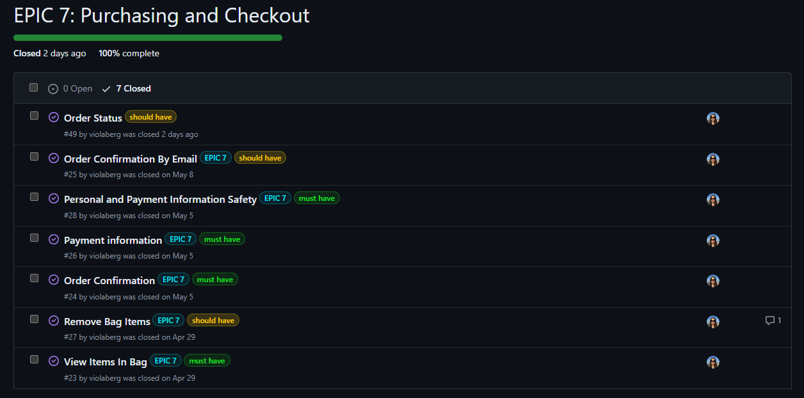

# **Agile Methodology**

## **Overview**

This project was created using Agile Methodology to split it in smaller tasks. To do so, I created user stories with acceptance criteria and grouped these into EPIC milestones so I can focus on one feature at the time.

### **EPIC**

In Agile tasks/user stories can be broken down into EPICS or Milestones. It's a helpful way to segment user stories based on needs/requests of end-users while working towards a fully functional project. 

I edited due dates few times as I learned in proccess how long time certain tasks take or for example, made different design choices, as sometimes when all is added together, changes are needed.

#### **EPIC 1**

I struggled with starting to create database schema as I'm still slightly confused about it but once started, it went surprisingly fast and wasn't as ard as I remember from project 4. Wireframes was one of the first things I did during planning phase, while some changes might occur during development, they show great base for this project.

EPIC 1

#### **EPIC 2**

EPIC 2

#### **EPIC 3**

EPIC 3

#### **EPIC 4**

EPIC 4

#### **EPIC 5**

EPIC 5

#### **EPIC 6**

EPIC 6

#### **EPIC 7**

EPIC 7

#### **EPIC 8**

EPIC 8

#### **EPIC 9**

EPIC 9

#### **EPIC 10**

EPIC 10

### **USER STORIES**

A user story serves as an explanation how a certain feature will provide a value to a user. The help developer to understand what and why they are building to provide a better end product overall. Boutique Ado walkthrough user stories were used for part of this project and some adjusted to suit it better, with more user stories added by myself.

[All user stories can be found following this link to my Github repository](https://github.com/violaberg/bling-it/issues)

### **MoSCoW METHOD**

A MoSCoW Method is a popular prioritization technique used in many projects, not only software development. It uses a 4-step approach of "must-have", "should-have", "could-have" and "won't-have".

MoSCoW

### **GITHUB KANBAN BOARD**

Kanban board is one way how to provide a visual for project management, optimize workflow and increase efficiency. As it is my first time fully implementing Kanban board, ups and downs and some inaccuracy was expected.

Github Kanban

## **Conclusion**

 As my experience grows using Agile, I found it much easier and less messy using it this time around. 
 Overall it was a great experience and kept me on track most of the time, as well as helped to understand how much is left to do as at times project felt never ending. 
 During this project I participated in hackathon and it was my first time being a SCRUM master which lead to even better understanding of Kanban board and how it works in real-life team work. I consider this experience very valuable and feel it helped me continue you with my own project.

[Back to Readme](README.md)