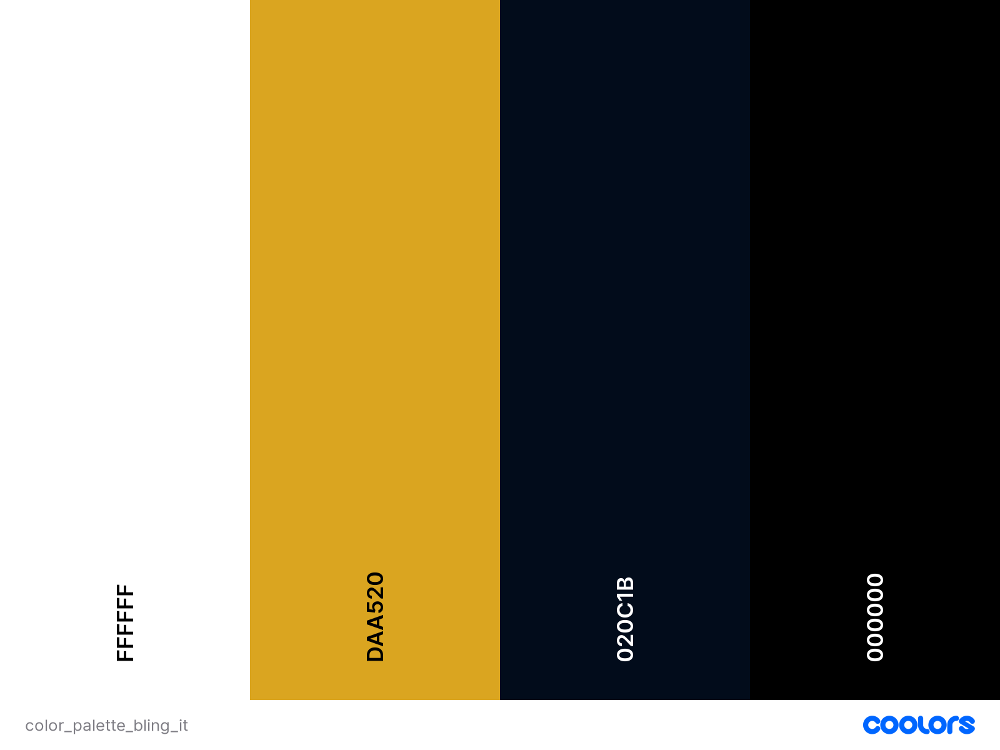

# **Bling It**

## **Overview**

Bling It is a fictional user-friendly gemstone shop, designed and developed using Django, Python, HTML, CSS and Javascript, born from my personal love for diamonds and rubies. 
It offers a chance to explore a curated collection of exquisite gemstones and discover diamonds, rubies, sapphires, emeralds, and more, meticulously categorized for easy browsing. Each gemstone page has an image, detailed specifications and pricing, as well as option to add gemstone to wishlist. Search can be customized by type, cut, color, and clarity to find the perfect piece. Added is a secure checkout process to ensure a safe and smooth transaction. 
 

Deployed project can be found here: [Bling It]()

## **Table of Contents**
* [**Overview**](#overview)
* [**User experience**](#user-experience-ux)
    + [**Strategy plane**](#strategy-plane)
        - [**Site goals**](#site-goals)
        - [**Opportunities**](#opportunities)
    + [**Scope plane**](#scope-plane)
    + [**Structure plane**](#structure-plane)
        - [**Developer Tasks & User Stories**](#developer-tasks--user-stories)
        - [**Flowchart**](#flowchart)
    + [**Skeleton plane**](#skeleton-plane)
        - [**Wireframes**](#wireframes)
    + [**Surface plane**](#surface-plane)
        - [**Color Scheme**](#color-scheme)
        - [**Typography**](#typography)
* [**Agile Development**](#agile-development)
* [**Features & Future Development**](#features--future-development)
* [**Technologies used**](#technologies-used)
* [**Testing**](#testing)
* [**Deployment**](#deployment)
* [**Acknowledgement & Credits**](#acknowledgement--credits)
* [**Media**](#media)

# **User experience (UX)**

During the planning phase I revisited UX videos provided on the course and used 5 planes to create my design.

## **Strategy plane**

### **Site goals**

Site goal is to give any gem lover/ collector a chance to jump into extraordinary journey of purchasing gemstones from comfort of their own home.

* Offer a fully responsive user-friendly site to browse through.
* Implement fully functional features.
* Aim to curate a diverse and exceptional collection of gemstones.
* Provide detailed information about each gemstone.
* Create a user-friendly interface with intuitive navigation and robust search capabilities.
* Create a responsive design for seamless browsing across devices.
* Implement a secure checkout process.
* Implement a wishlist feature.
* Offer ability to leave a review and read other user reviews.
* Implement SEO best practices to improve visibility in search engines and leverage digital marketing strategies.

### **Opportunities**

Opportunity | Importance | Viability/Feasibility
---|---|---
Newsletter list | 3 | 5
User register/login | 5 | 5
User profile | 3 | 1
User reviews | 5 | 5
User messages for actions taken | 5 | 5
Full CRUD funcionality for user | 5 | 5
Full CRUD funcionality for admin | 5 | 5
Admin login | 5 | 5
Product filters/searching | 5 | 5
Password recovery | 5 | 5
Order confirmation on site | 5 | 5
Order confirmation by email | 5 | 5
Option to safely pay for order with Stripe | 3 | 1
Delivery information 4 | 4
Order history in profile | 3 | 3
Special offers | 5 | 5
About page | 5 | 5
Contact form | 5 | 5
Social media links | 3 | 5
SEO implementation | 5 | 5
Privacy Policy | 3 | 3
FAQ | 2 | 2
Gemstone blog 1 | 1
---|---|---
Total |95|96

## **Scope plane**

Due to a incredible amount of new knowledge and deadline for this project as for anything in life and to avoid scope creep, I used MoSCoW method to keep project on track and concentrate on delivering fully functional site. Unfortunately, since beginning of the project I knew I won't have time to implement everything I would like so decided to leave some features for future development. During development some features might be added/ discarded and some design changes are possible.

* Must Have:
    + Admin login
    + Purchase total
    + Product list
    + Individual product page
    + Order confirmation
    + Personal and payment information safety
    + Payment information
    + View items in bag
    + Add a product
    + Edit/update a product
    + Delete a product
    + Contact details

* Should Have:
    + User register
    + User login/logout
    + Personalized profile
    + Adjust bag items
    + Specials
    + Sorting list
    + Product search
    + Search results
    + Order confirmation by email
    + Contact form

* Could Have:
    + Sorting multiples
    + Gemstone type
    + Wishlist
    + Rating
    + Leave a review
    + Edit/update review
    + Delete a review
    + Email confirmation after registration
    + Password recovery
    + Subscription

* Won't Have:
    + Bling It blog

## **Structure plane**

### **Developer Tasks & User Stories**

|   EPIC                    |ID|    Task        |
|:--------------------------|--|:---------------|
|SET UP & DEPLOYMENT        |  ||
|                           |  | As a developer, I can create a new Github repository to store my project files online|
|                           |  | As a developer, I can create a new workspace on Gitpod, install Django and add required libraries to have access to cloudbased images and postgress database|
|                           |  | As a developer, I can create a Heroku app and deploy project early to confirm funcionality|
|                           |  ||

 

|   EPIC                    |ID|    User Story  |
|:--------------------------|--|:---------------|
|NAVIGATION AND CONTENT     |  ||
|                           |  | As a user, I can navigate through website easily|
|                           |  | As a user, I can clearly understand the purpose of the site|
|                           |  | As a user, I can read relevant content|
|USER REGISTRATION & LOGIN  |  ||
|                           |  | As a user, I can register on the site|
|                           |  | As a user, I can login using USERNAME and password|
|                           |  | As a user, I can logout|
|BOOKING                    |  ||
|                           |  | As a user, I can book a tour|
|                           |  | As a logged-in user, I can see my booking|
|                           |  | As a logged-in user, I can edit my booking|
|                           |  | As a logged-in user, I can cancel my booking|
|REVIEWS                    |  ||
|                           |  | As a user, I can read reviews from other visitors|
|                           |  | As a logged-in user, I can leave a review|
|                           |  | As a logged-in user, I can add my photo taken at wine cellar when leaving a review|
|                           |  | As a logged-in user, I can delete my previously added photo to review|
|                           |  | As a logged-in user, I can edit my review|
|                           |  | As a logged-in user, I can delete my review|
|BLOG                       |  ||
|                           |  | As a user, I can see a paginated list of posts|
|                           |  | As a user, I can click on a post to see full text|
|COMMENTS                   |  ||
|                           |  | As a logged-in user, I can write a comment on post|
|                           |  | As a logged-in user, I can edit my comment|
|                           |  | As a logged-in user, I can delete my comment|
|                           |  | As a user, I can read other people comments|
|GALLERY                    |  ||
|                           |  | As a user, I explore images in gallery|
|CONTACT                    |  ||
|                           |  | As a user, I can find wine cellar's opening hours|
|                           |  | As a user, I can find wine cellar's location|
|                           |  | As a user, I can contact someone at wine cellar|
|ADMIN                      |  ||
|                           |  | As an admin, I can login to access admin panel|
|                           |  | As an admin, I can add/edit content|
|                           |  | As an admin, I can create draft posts|
|                           |  | As an admin, I can create, read, update and delete posts|
|                           |  | As an admin, I can delete inappropriate reviews/photos|
|                           |  | As an admin, I can approve comments|
|                           |  | As an admin, I can delete inappropriate comments|
|                           |  | As an admin, I can upload/ delete images from gallery|
|                           |  | As an admin, I can add description to images in gallery|
|DEVELOPER                  |  ||
|                           |  | As a developer, I can create wireframes|
|                           |  | As a developer, I can create a fully responsive site|
|                           |  | As a developer, I can choose color scheme and style of the website|
|                           |  | As a developer, I can choose fonts|
|                           |  ||

### **Flowchart**

To help with a flow of the website, I created a flowchart using [Draw.io](https://www.drawio.com/)

## **Skeleton plane**

### **Wireframes**

Wireframes for both desktop and mobile were created with [Balsamiq](https://balsamiq.com/) and can be seen below:

#### **Original wireframes:**

#### **Desktop wireframes:**

#### **Mobile wireframes:**

Home Page

About Page

Gallery Page

Gemstone Page

Contact Page

Contact Success Page

Login Page

Logout Page

Register Page

### **Database schema**

## **Surface plane**

### **Color Scheme**

To add more depth and interest to design but not make it overwhelming for user to look at, I created a pattern for background using two of my colors - Midnight Blue `#020c1b` and Goldenrod `#daa520`. 
Midnight Blue is a deep, dark shade of blue resembling the color of a moonlit night sky. It conveys a sense of mystery, depth, and tranquility, providing a striking contrast to lighter elements. As a background color it serves as a sophisticated backdrop that enhances the visual appeal of gemstones, allowing them to stand out vividly while creating a calming and immersive browsing experience. 
Goldenrod is a warm and rich yellow-gold color reminiscent of the golden hue of ripe wheat fields or autumn leaves. It exudes a sense of warmth, vibrancy, and luxury, making it an excellent choice for adding a touch of elegance to project. As part of background it creates a welcoming and inviting atmosphere, evoking feelings of opulence and sophistication that complement the beauty of gemstones. 
Combining the warm, luxurious tones of Goldenrod with the deep, serene tones of Midnight Blue, creates a visually captivating and harmonious color palette for Bling It gemstone app. This color scheme can effectively highlight the beauty and elegance of gemstone offerings while providing a pleasing backdrop for typography and design elements.

### **Typography**

In planning the visual identity of my website, I meticulously selected two Google fonts, Parisienne and Cormorant Garamond. 
Parisienne is an elegant and flowing script font that evokes a sense of romance and sophistication. With its graceful strokes and whimsical charm, Parisienne adds a touch of luxury to brand. This font is perfect for headings, logos, and special accents, enhancing the overall visual appeal of Bling It app. 
Cormorant Garamond is a classic serif font known for its timeless elegance and readability. Inspired by the traditional Garamond typefaces, Cormorant Garamond features delicate serifs and balanced proportions, making it ideal for body text and longer passages. This font exudes refinement and professionalism, enhancing the overall readability and aesthetic of Bling It gemstone app. 
Combining Parisienne for decorative elements and headings with Cormorant Garamond for body text and details, creates a harmonious typography scheme that reflects the sophistication and style associated with gemstones. These fonts enhance the overall visual identity of my project, making it both inviting and professional. 

# **Agile Development**

I have included details of agile development in a separate file [AGILE.md](AGILE.md).

# **Features & Future Development**

## **Features**

* Logo created using [Vecteezy](https://www.vecteezy.com/) - original image by joko sutrisno, available at this [link](https://www.vecteezy.com/vector-art/6552384-diamond-abstract-logo)

* Favicon created using [Favicon Generator](https://www.favicongenerator.com/)

## **Future Development**

In the second half of development I realized what I won't be able to implement due to dealine fast approaching. I decided to leave following features for future development:
* 

# **Technologies used**

* HTML
* CSS
* Javascript
* Python
* Django
* Django allAuth
* Bootstrap
* [Heroku](https://www.heroku.com/)
* Heroku PostreSQL & [ElephantSQL](https://www.elephantsql.com/)
* Jinja
* Whitenoise
* Cloudinary
* Summernote

# **Testing**

I have included details of testing in a separate file [TESTING.md](TESTING.md).

# **Deployment**

I have included details of testing in a separate file [DEPLOYMENT.md](DEPLOYMENT.md).

# **Acknowledgement & Credits**

* [Hero Patterns](https://heropatterns.com/) - background pattern
* [Google Fonts](https://fonts.google.com/) - fonts
* [Font Awesome](https://fontawesome.com/) - icons
* Walkthrough Boutique Ado from Code Institute course used to set up my project, styled and adjusted to suit my own project.
* Choccolate menu taken from [Codepen](https://codepen.io/Kechicheb/pen/WNyZqYJ)

* The biggest thank you as always to my family during this busy time of juggling the biggest project so far, hackathon and life in general.
* Thank you as well to my mentor [David Bowers](https://github.com/dnlbowers) who supported me from the very beginning always giving the best advice and ideas for solutions and more importantly never losing hope in me, even when I did.
* And thank you to [Kim](https://github.com/kimatron) for continuous support during late and long nights and in general for convincing me to take on this course.
* And last but not least, thank you to Code Institute for organising hackathons. They have been a tremendous learning opportunity and therefore a great help during my project struggles.

# **Media**

## **Images**
* [Vecteezy](https://www.vecteezy.com/) - image by joko sutrisno, available at this [link](https://www.vecteezy.com/vector-art/6552384-diamond-abstract-logo)