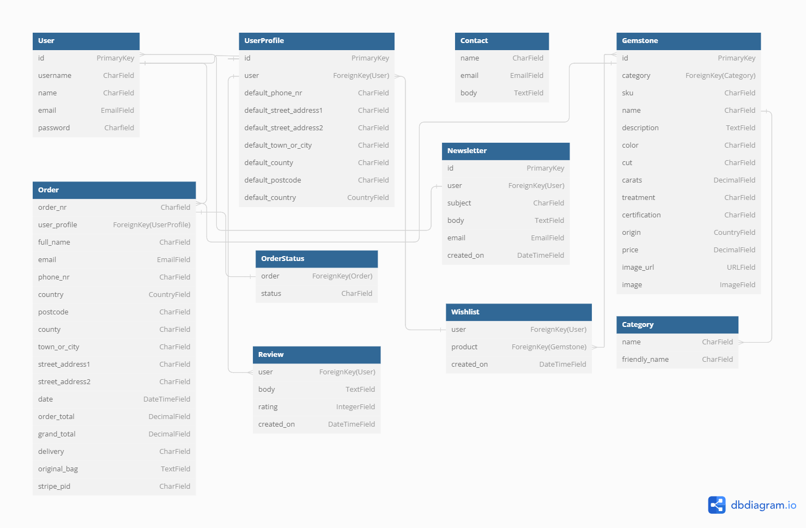
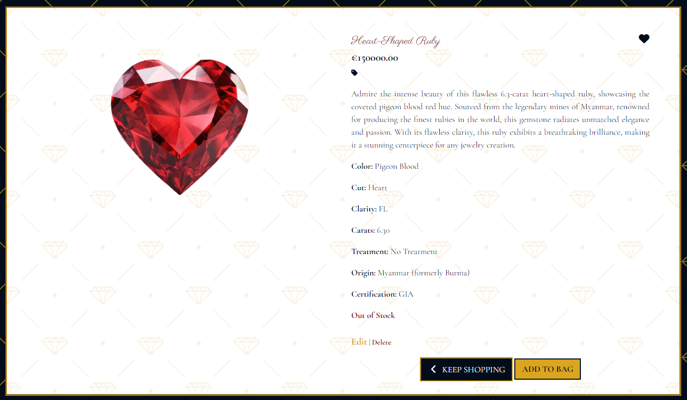
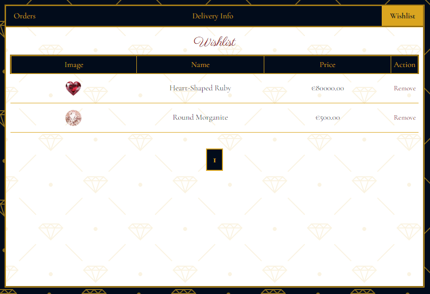

# **Bling It**

## **Overview**

Bling It is a fictional user-friendly gemstone shop, designed and developed using Django, Python, HTML, CSS and Javascript, born from my personal love for diamonds and rubies. 
It offers a chance to explore a curated collection of exquisite gemstones and discover diamonds, rubies, sapphires, emeralds, and more, meticulously categorized for easy browsing. Each gemstone page has an image, detailed specifications and pricing, as well as option to add gemstone to wishlist. Search can be customized to find the perfect piece. Users can read and, if logged in, leave reviews about their experience with Bling It shop. Added is a secure checkout process to ensure a safe and smooth transaction.
 
 

Deployed project can be found here: [Bling It](https://bling-it-242ac659e1b6.herokuapp.com/)

## **Table of Contents**
* [**Overview**](#overview)
* [**User experience**](#user-experience-ux)
    + [**Strategy plane**](#strategy-plane)
        - [**Site goals**](#site-goals)
        - [**Opportunities**](#opportunities)
    + [**Scope plane**](#scope-plane)
    + [**Structure plane**](#structure-plane)
        - [**Developer Tasks & User Stories**](#developer-tasks--user-stories)
    + [**Skeleton plane**](#skeleton-plane)
        - [**Wireframes**](#wireframes)
            - [**Desktop wireframes**](#desktop-wireframes)
            - [**Mobile wireframes**](#mobile-wireframes)
        - [**Database schema**](#database-schema)
        - [**Stock keeping units**](#stock-keeping-units)
    + [**Surface plane**](#surface-plane)
        - [**Color Scheme**](#color-scheme)
        - [**Background pattern**](#background-pattern)
        - [**Typography**](#typography)
* [**Agile Development**](#agile-development)
* [**Business Model, SEO & Marketing**](#business-model-seo--marketing)
    - [**Business Model**](#business-model)
    - [**SEO**](#seo)
    - [**Marketing**](#marketing)
* [**Features & Future Development**](#features--future-development)
    - [**Features**](#features)
    - [**Future Development**](#future-development)
* [**Technologies used**](#technologies-used)
* [**Testing**](#testing)
* [**Deployment**](#deployment)
* [**Acknowledgement & Credits**](#acknowledgement--credits)
* [**Media**](#media)
    - [**Images**](#images)

# **User experience (UX)**

During the planning phase I revisited UX videos provided on the course and used 5 planes to create my design. Due to type of e-commerce app I was planning and natural gemstones always being exclusive items with no two being the same, there won't be an option to increment amount of gemstones in a bag and I decided not to have reviews and ratings for individual gemstones bought but instead give user an option to leave a review/ rating for Bling It as a business and their experience as customer, allowing to mention gemstones purchased if wished. As gemstones can be very expensive, not disclosing what each user has bought specifically ensures for additional safety.

## **Strategy plane**

### **Site goals**

Site goal is to give any gem lover/ collector a chance to jump into extraordinary journey of purchasing gemstones from comfort of their own home.

* Offer a fully responsive user-friendly site to browse through.
* Implement fully functional features.
* Aim to curate a diverse and exceptional collection of gemstones.
* Provide detailed information about each gemstone.
* Create a user-friendly interface with intuitive navigation and robust search capabilities.
* Create a responsive design for seamless browsing across devices.
* Implement a secure checkout process.
* Implement a wishlist feature.
* Offer ability to leave a review and read other user reviews.
* Implement SEO best practices to improve visibility in search engines and leverage digital marketing strategies.

### **Opportunities**

Opportunity | Importance | Viability/Feasibility
---|---|---
Newsletter | 3 | 5
User register/login | 5 | 5
User profile | 5 | 5
User reviews | 3 | 4
User messages for actions taken | 5 | 5
Full CRUD funcionality for user | 5 | 5
Full CRUD funcionality for admin | 5 | 5
Admin login | 5 | 5
Product filters/searching | 5 | 5
Password recovery | 5 | 5
Order confirmation on site | 5 | 5
Order confirmation by email | 5 | 5
Option to safely pay for order with Stripe | 5 | 5
Delivery information | 4 | 4
Order history in profile | 3 | 3
Special offers | 1 | 3
About page | 5 | 5
Contact form | 5 | 5
Social media links | 3 | 5
Wishlist | 3 | 3
SEO implementation | 5 | 5
Privacy Policy | 3 | 3
FAQ | 2 | 2
Gemstone blog | 1 | 1
---|---|---
Total |96|103

## **Scope plane**

Due to a incredible amount of new knowledge and deadline for this project as for anything in life and to avoid scope creep, I used MoSCoW method to keep project on track and concentrate on delivering fully functional site. Unfortunately, since beginning of the project I knew I won't have time to implement everything I would like so decided to leave some features for future development. During development some features might be added/ discarded and some design changes are possible. My MoSCoW method planning can be seen below:

* Must Have:
    + Admin login
    + User register
    + User login/logout
    + Purchase total
    + Product list
    + Individual product page
    + Order confirmation
    + Personal and payment information safety
    + Payment information
    + View items in bag
    + Add a product
    + Edit/update a product
    + Delete a product
    + Contact details

* Should Have:
    + Gemstone category
    + Personalized profile
    + Adjust bag items
    + Sorting list
    + Product search
    + Search results
    + Order confirmation by email
    + Contact form
    + Privacy Policy

* Could Have:
    + Wishlist
    + Rating
    + Leave a review
    + Delete a review for admin
    + Email confirmation after registration
    + Password recovery
    + Subscription
    + FAQ

* Won't Have:
    + Bling It blog
    + Sorting multiples
    + Edit/update review
    + Delete a review for user

## **Structure plane**

### **Developer Tasks & User Stories**

|   EPIC                    |    Task        |
|:--------------------------|:---------------|
|PLANNING                   ||
|                           | As a developer I can create a flowchart so that I can clearly see the logic of the site|
|                           | As a developer I can create ERD so that I can clearly see my project's schema|
|                           | As a developer I can create wireframes so that I can clearly see the planned site layout|
|                           | As a developer I can choose color palette and style of the site so that I can have a clear vision of end result|
|                           | As a developer I can choose fonts so that I can create a sophisticated site|
|SET UP & DEPLOYMENT        ||
|                           | As a developer, I can create a new Github repository to store my project files online|
|                           | As a developer, I can create a new workspace on Gitpod, install Django and postgress database|
|                           | As a developer, I can create a Heroku app and deploy project early to confirm funcionality|
|                           | As a developer I can design a responsive app so that I can ensure it's easy to use on any device |
|                           | As a developer I can create user-friendly error pages so that I can guide user safely back to home page |
|                           ||

 

|   EPIC                    |  User Story  |
|:--------------------------|:-------------|
|VIEWING AND NAVIGATING     ||
|                           | As a user I can view a list of products so that I can select some to purchase if I like|
|                           | As a user I can individual product detail page so that I can identify price, description, product image and any other additional information |
|                           | As a user I can add items I like to my wishlist so that I can find them easily if I decide to purchase later |
|                           | As a user I can quickly identify deals, clearance items and special offers so that I can take advantage of special savings on products I'd like to purchase|
|                           | As a user I can add items I like to my wishlist so that I can find them easily if I decide to purchase later|
|                           | As a user I can easily view the total of my purchase at any time so that I can avoid spending too much|
|REGISTRATION & USER ACCOUNTS  ||
|                           | As a user I can register on site so that I can save my personal information and wishlist|
|                           | As a user I can login/ logout so that I can access my personal account information|
|                           | As a user I can easily recover my password in case I forget it so that I can recover access to my account|
|                           | As a user I can receive an email confirmation after registration so that I can verify that my account registration has been successful |
|                           | As a user I can have a personalized user profile so that I can view my personal order history and order confirmation, and save my payment information|
|                           | As a user I can receive an email confirmation after registration so that I can verify that my account registration has been successful|
|ADMIN & STORE MANAGEMENT   ||
|                           | As an admin I can easily login so that I can update site when needed|
|                           | As an admin I can add a product so that I can add new items to store|
|                           | As an admin I can edit/ update a product so that I can change product prices, descriptions, images and other product criteria|
|                           | As an admin I can delete a product so that I can remove items that are no longer for sale|
|SORTING & SEARCHING        ||
|                           | As a user I can search for a product by name or a description so that I can find a specific product I'd like to purchase|
|                           | As a user I can easily see what I've searched for and the number of results so that I can quickly see whether the product I want is available and decide if I want to purchase it|
|                           | As a user I can sort the list of available products so that I can easily identify the best priced products|
|                           | As a user I can sort multiple gemstones simultaneously so that I can search through several gemstones I like at the same time to choose the best option|
|PURCHASING & CHECKOUT      ||
|                           | As a user I can view items in my bag to be purchased so that I can identify the total cost of my purchase and all items I will receive|
|                           | As a user I can remove individual items from my bag so that I can easily make changes to my purchase before checkout|
|                           | As a user I can easily enter my payment information so that I can check out quickly and with no hassle|
|                           | As a user I can feel my personal and payment information is safe and secure so that I can confidently provide the needed information to make a purchase|
|                           | As a user I can check my order status so that I can know when to expect it |
|                           | As a user I can view an order confirmation after checkout so that I can verify that I haven't made any mistakes|
|                           | As a user I can receive an email confirmation after checking out so that I can keep the confirmation of what I've purchased for my records|
|REVIEWS & RATINGS          ||
|                           | As a user I can leave a rating for the site so that I can let others know of my experience with shop|
|                           | As a user I can leave a review so that I can contribute to the community and help others to make informed decisions|
|                           | As a user I can edit/ update my review so that I can update and refine my contributions, ensuring accuracy and relevance|
|                           | As a user I can delete my review so that I can have control over the content associated with myself|
|                           | As an admin I can delete review so that I can ensure appropriate content on app |
|CONTACT                    ||
|                           | As a user I can easily locate contact details so that I can contact shop if I need|
|                           | As a user I can contact someone at Bling It so that I can receive any additional information needed|
|                           | As a user I can subscribe to newsletters so that I can receive the latest news, special offers and sales notifications|
|FAQ & PRIVACY POLICY       ||
|                           | As an admin I can create/edit a list of FAQ so that I can offer users instant answers to their questions|
|                           | As a user I can read through FAQ so that I can find answers to my questions without contacting shop|
|                           | As a user I can read Privacy Policy so that I can see how my personal information, data will be used and what rights I have|
|                           ||

## **Skeleton plane**

### **Wireframes**

Wireframes for both desktop and mobile were created with [Balsamiq](https://balsamiq.com/) and can be seen below. Please keep in mind that some changes were made during development but basis for project were designed in these wireframes:

#### **Desktop wireframes:**

Home Page

About Page

All Gemstones Page

Gemstone Page

Contact Page

Contact Confirmation Page

FAQ Page

Privacy Policy Page

#### **Mobile wireframes:**

Home Page

About Page

All Gemstones Page

Gemstone Page

Contact Page

Contact Confirmation Page

FAQ Page

Privacy Policy Page

### **Database schema**

I created database schema to design the structure and organization of a database to efficiently store, manage, and retrieve data. This was crucial part when creating models and try and escape unneccesary migration complications. I still find it a little hard to create these but it has definitely become easier. Original and updated database schema can be found below:

### **Stock keeping units**

As I didn't use dataset but entered all gemstones manually through admin panel, I created a system to generate SKU numbers consistently as to resemble real-life scenario. In table bellow I've enter one gemstone as example of system I followed. This specific gemstone belongs to category 'Diamonds', originated in South Africa, is 3 carats in weight, flawless in clarity and as I entered it as second item, stock ID is 0002. Altogether it creates SKU - DSA3FL0002. I did some research before and know there are SKU generators but decided to go ahead with my own as to better memorize how SKU is created.

| Category | Origin | Carats | Clarity | Stock ID | SKU number |
| -------- | ------ | ------ | ------- | -------- | ---------- |
| Diamonds | SA | 3 | FL | 0002 | DSA3FL0002 |

## **Surface plane**

### **Color Scheme**

For this project I chose 4 colors - White `#ffffff`, Goldenrod `#daa520`, Deep Red `#880101` and Midnight Blue `#020c1b`. This color palette combines the purity of white with the warmth of goldenrod and the depth of midnight blue, creating a harmonious balance of sophistication and elegance. The colors work together to highlight the beauty of gemstones and create a luxurious, visually engaging and immersive experience for users.
* `#ffffff` - White represents purity and elegance. It serves as a clean and neutral backdrop, allowing other design elements to stand out vividly. 
* `#daa520` - Goldenrod is a warm and luxurious yellow-gold color, reminiscent of precious metals and sun-kissed hues. It adds a touch of sophistication and vibrancy. 
* `#880101` - Deep Red is a rich and intense hue that evokes a sense of passion and power. Its deep, ruby-like shade adds a touch of boldness and luxury, enhancing the visual impact and creating a striking contrast against lighter colors.
* `#020c1b` - Midnight Blue is a deep, rich shade of blue that conveys mystery, elegance, and depth. It provides a striking contrast and a sense of tranquility. 

### **Background pattern**

To add more depth and interest to design but not make it overwhelming for user to look at, I created a pattern for background using two of my colors - Midnight Blue `#020c1b` and Goldenrod `#daa520`. 
Midnight Blue is a deep, dark shade of blue resembling the color of a moonlit night sky. It conveys a sense of mystery, depth, and tranquility, providing a striking contrast to lighter elements. As a background color it serves as a sophisticated backdrop that enhances the visual appeal of gemstones, allowing them to stand out vividly while creating a calming and immersive browsing experience. 
Goldenrod is a warm and rich yellow-gold color reminiscent of the golden hue of ripe wheat fields or autumn leaves. It exudes a sense of warmth, vibrancy, and luxury, making it an excellent choice for adding a touch of elegance to project. As part of background it creates a welcoming and inviting atmosphere, evoking feelings of opulence and sophistication that complement the beauty of gemstones. 
Combining the warm, luxurious tones of Goldenrod with the deep, serene tones of Midnight Blue, creates a visually captivating and harmonious color palette for Bling It gemstone app. This color scheme can effectively highlight the beauty and elegance of gemstone offerings while providing a pleasing backdrop for typography and design elements.

### **Typography**

In planning the visual identity of my website, I meticulously selected two Google fonts, Parisienne and Cormorant Garamond. 
Parisienne is an elegant and flowing script font that evokes a sense of romance and sophistication. With its graceful strokes and whimsical charm, Parisienne adds a touch of luxury to brand. This font is perfect for headings, logos, and special accents, enhancing the overall visual appeal of Bling It app. 
Cormorant Garamond is a classic serif font known for its timeless elegance and readability. Inspired by the traditional Garamond typefaces, Cormorant Garamond features delicate serifs and balanced proportions, making it ideal for body text and longer passages. This font exudes refinement and professionalism, enhancing the overall readability and aesthetic of Bling It gemstone app. 
Combining Parisienne for decorative elements and headings with Cormorant Garamond for body text and details, creates a harmonious typography scheme that reflects the sophistication and style associated with gemstones. These fonts enhance the overall visual identity of my project, making it both inviting and professional. 

# **Agile Development**

I have included details of agile development in a separate file [AGILE.md](AGILE.md).

# **Business Model, SEO & Marketing**

## **Business Model**

Bling It operates as a B2C (Business-to-Consumer) ecommerce model, an online retail platform for individual clients specializing in high-quality gemstones. Business model revolves around offering a curated selection of exquisite, ethically-sourced gemstones, including rubies, sapphires, emeralds, and diamonds, catering to a discerning clientele seeking luxury, elegance and uniqueness. By maintaining direct relationships with reputable gemstone suppliers and artisans, shop ensures the authenticity and superior quality of the gemstones offered. 
The target audience include affluent individuals, collectors, and connoisseurs of gemstones, typically aged 30 and above, who seek unique and timeless pieces to complement their personal style and celebrate special occasions. We also target professional women and men who appreciate the elegance and craftsmanship of bespoke jewelry, as well as young couples looking for exquisite engagement ring and wedding band gemstones. Additionally, Bling It appeals to gift-givers who desire to present their loved ones with meaningful and luxurious gifts. Audience is geographically diverse, with a strong presence in major metropolitan areas and an appreciation for online shopping convenience and high quality service.

## **SEO**

SEO, or Search Engine Optimization, is the process of improving your website to increase its visibility when people search for products or services related to your business on search engines like Google. The better visibility your pages have in search results, the more likely you are to attract attention and draw prospective and existing customers to your business. All search in Google was done in incognito window.
I didn't use [Wordtracker](https://www.wordtracker.com/search) as suggested in lessons as I heard pretty bad reviews about it and wasn't willing to pay to check it myself. For keyword research purposes I used [Keyword Surfer](https://surferseo.com/keyword-surfer-extension/) Chrome extension and checked search results directly in Google Tools. I have included a brain dump using keywords and Google to return a list of long and short-tail keywords. All screenshots can be found in [SEO](static/docs/seo) folder. Below I have added tables created so search results are better visible:

Search results

Search results

After concluding my research I added descriptive meta tags to the project.

To improve content I used questions from Content Challenge on CI learning platform: 

* ***What do your users need?*** 
Users need high-quality gemstones, detailed product information, safe way to pay and reliable customer service.

* ***What information and features can you provide to meet those needs?*** 
Provide detailed product descriptions, high-resolution images, user reviews, a secure checkout process, and a comprehensive FAQ section.

* ***How can you make the information easy to understand?*** 
Use clear and concise language, bullet points for key information, and visual aids like images and videos.

* ***How can you demonstrate expertise, authoritativeness, and trustworthiness in your content?*** 
Include detailed product information, customer testimonials, expert blog posts, and certifications or awards.

* ***Would there be other pages within your own site you could link to from your chosen page?*** 
Yes, link to related products, customer reviews, privacy policy, and the FAQ section.

* ***Are there opportunities to link back to external websites that already rank highly on Google?*** 
Yes, link to industry authority sites and gemstone certification bodies.

* ***How can you help users discover other relevant parts of your web application?*** 
Use related product suggestions, internal linking, clear navigation menus, and a search function.

## **Marketing**

I followed the same idea for marketing as with SEO and used questions from CI learning platform to help:

* ***Who are your users?*** 
Users are gemstone enthusiasts, jewelry collectors, and individuals looking for unique, high-quality gemstones.

* ***Which online platforms would you find lots of your users?*** 
Users can be found on social media platforms (my personal favourite Instagram, Pinterest and Facebook for ads), gemstone forums, and jewelry-related websites.

* ***Would your users use social media? If yes, which platforms do you think you would find them on?*** 
Yes, users would likely be active on Instagram, Pinterest, and Facebook due to the visual nature of gemstones.

* ***What do your users need? Could you meet that need with useful content? If yes, how could you best deliver that content to them?*** 
Users need detailed product information, safe payment option, great customer service, buying guides and care tips, social media updates, and newsletters. 
    - **Detailed product information** will be included on gemstone detail page.
    - **Safe payment option** will be achieved by using Stripe and contact form created/ contact details added to ensure outstanding customer service.
    - **Buying guides** and **care tips** could be delivered through future blog posts (unless there is time left during project to create info page/ blog) and small care tip card added with each order delivered.
    - **Social media updates** would be handled by shop admin until enough income is created to hire content creator for social media accounts. 
    - **Newsletter** form is visible on Home page of the project. A newsletter can significantly benefit an e-commerce store by keeping customers engaged and informed about new products, promotions, and exclusive offers. It serves as a direct line of communication, fostering customer loyalty and driving repeat business. By sharing valuable content and personalized recommendations, newsletters enhance the shopping experience and keep your brand top-of-mind. Additionally, they provide insights into customer preferences and behaviors, helping to refine marketing strategies and improve overall customer satisfaction.

* ***Would your business run sales or offer discounts? How do you think your users would most like to hear about these offers?*** 
Yes, our business could run sales and offer discounts in near future. Users would hear about these offers through email newsletters, social media posts, and website banners.

* ***What are the goals of your business? Which marketing strategies would offer the best ways to meet those goals?*** 
The goals are to increase sales, build brand awareness, and retain customers. Effective marketing strategies include content marketing, social media engagement, email marketing, and possible influencer collaborations.

* ***Would your business have a budget to spend on advertising? Or would it need to work with free or low-cost options to market itself?*** 
The business would have a modest budget for advertising but would also utilize free or low-cost options such as social media marketing, SEO, and email campaigns. A lot can be done by owner/ admin at the beginning to help with budget, promoting posts on Instagram isn't as expensive as one might think, limits can be set so to keep control of expenses and be evaluated later to see if more budget can be allocated for paid ads on social media. Incredible option for marketing is sharing posts on Instagram and Facebook and creating reels. To achieve quicker follower growth a small giveaway could be created with certain rules set such as:
    - ***follow us***
    - ***like and save post***
    - ***comment on post***
    - ***tag x amount of friends***
    - ***share to your story and tag us***

    Additionally we would use Google Ads which are an amazing way to increase brand awareness and help with SEO. Using Google Ads can also help with the use of long-tail keywords and help with the ranking of the site.

* Facebook page was created during development and screenshots can be found below:
    

Facebook Page

    

Welcome Post

    Page can be accessed following this link, unless it's deleted by Facebook due to not being a real bussiness: [Bling It Facebook Page](https://www.facebook.com/profile.php?id=61559857025144)

# **Features & Future Development**

## **Features**

* Favicon 

    

* Brand name with logo 

    

* Navigation 

    

* Menu 

    

* Toast 

    

* Sign up 

    

* Login 

    

* Subscription form 

    

* Contact form 

    

* FAQ page 

    

* Footer 

    

* Gemstone card 

    

* Gemstone detail card 

    

* Profile - orders tab 

    

* Profile - delivery tab 

    

* Profile - wishlist tab 

    

* Review 

    

* Review form 

    

## **Future Development**

In the second half of development I realized what I won't be able to implement due to dealine fast approaching. Some of the features I decided to leave for future development can be seen below:
* Ability for user to edit or delete their review. At the moment only admin can delete it.
* Confirmation modal before deletion of reviews and gemstones.
* Option to sort multiple category gemstones, for example, if someone would like to look at rubies and diamonds at the same time but filter the other gemstones out.
* Knowledge blog where users could educate themselves about gemstones, find out their history and read latest news or trends.

# **Technologies used**

* HTML
* CSS
* Javascript
* Python
* Django
* Django allAuth
* Bootstrap
* [Heroku](https://www.heroku.com/)
* [ElephantSQL](https://www.elephantsql.com/)
* Jinja
* jQuery
* Whitenoise
* AWS S3 Bucket

# **Testing**

I have included details of testing in a separate file [TESTING.md](TESTING.md).

# **Deployment**

I have included details of testing in a separate file [DEPLOYMENT.md](DEPLOYMENT.md).

# **Acknowledgement & Credits**

* [Hero Patterns](https://heropatterns.com/) used to create background pattern
* [Google Fonts](https://fonts.google.com/) used to find and implement fonts
* [Font Awesome](https://fontawesome.com/) used for icons
* Logo created using [Vecteezy](https://www.vecteezy.com/) - original image by joko sutrisno, available at this [link](https://www.vecteezy.com/vector-art/6552384-diamond-abstract-logo)
* Favicon created using [Favicon Generator](https://www.favicongenerator.com/)
* Database schemas created using [DB diagram](https://dbdiagram.io/home) and [Graphviz](https://graphviz.org/)
* Walkthrough Boutique Ado from Code Institute course used to set up my project, styled and adjusted to suit my own project
* Chocolate menu taken from [Codepen](https://codepen.io/Kechicheb/pen/WNyZqYJ)
* Animation for loader taken from [CSS-tricks](https://css-tricks.com/making-css-animations-feel-natural/)
* Hover tabs for profile page taken from [W3schools](https://www.w3schools.com/howto/howto_js_hover_tabs.asp)
* Compressed images with [Tinify](https://tinypng.com/) and [Compressor](https://compressor.io/)
* Privacy Policy generated with [Privacy Policy Generator](https://www.privacypolicygenerator.info/)
* [Keyword Surfer](https://surferseo.com/keyword-surfer-extension/) used for some Google searches
* Search result table generated with [Table Generator](https://www.table-generator.de/)
* Review pagination added using sample from [Geeks for geeks](https://www.geeksforgeeks.org/how-to-add-pagination-in-django-project/)
* [Stack Overflow](https://stackoverflow.com/questions/77482831/smtp-starttls-got-an-unexpected-keyword-argument-keyfile) used to fix email confirmation error
* Gemstone information in FAQ section was created with ChatGPT

* The biggest thank you as always to my family during this busy time of juggling the biggest project so far, hackathon and life in general.
* Thank you as well to my mentor [David Bowers](https://github.com/dnlbowers) who supported me from the very beginning always giving the best advice and ideas for solutions and more importantly never losing hope in me, even when I did.
* And thank you to [Kim](https://github.com/kimatron) for continuous support during late and long nights and in general for convincing me to take on this course.
* A big thank you to all Slack community and Code Institute tutors for helping out when I was stuck.
* And last but not least, thank you to Code Institute for organising hackathons. They have been a tremendous learning opportunity and therefore a great help during my project struggles.

# **Media**

## **Images**
* [Vecteezy](https://www.vecteezy.com/) - image by joko sutrisno, available at this [link](https://www.vecteezy.com/vector-art/6552384-diamond-abstract-logo)
* Hero image was generated with [Adobe Firefly](https://firefly.adobe.com/)
* Few gemstone images were generated with [Adobe Firefly](https://firefly.adobe.com/), the rest taken from [Kaggle](https://www.kaggle.com/datasets/fransell/gemstones-images-expanded/data)

# **Conclusion**

Now when I look back at rather stressful and extremely busy time while developing this project (I'm pretty sure my family has forgotten about my existence), I can see many positives and negatives. I'm glad I took my mentor's advice to spend a week planning to have smoother development. And while I had many bumps, I think it really helped me achieve the end result and submit on time. I will keep practising Agile and try and set sprints for my next project that has been slowly developing for months in my head. Overall, I really enjoyed this project and now looking at it I can justify many sleepless nights. I take every project as a new lesson in something or reminder of skills I have. This one was for Stripe and AWS, still rather puzzled how many features and options there are in both but will go back and dive deeper into those. Can't wait to develop the next one!
