# **TESTING**

## **Table of Contents**
* [**User Story Testing**]()
* [**Code Validation**]()
    + [**HTML**]()
    + [**CSS**]()
    + [**JavaScript**]()
    + [**Python**]()
* [**Browser Testing**]()
* [**Device Testing**]()
* [**Lighthouse**]()
* [**Manual Testing**]()
    + [**Navigation**]()
    + [**Home Page**]()
    + [**About Page**]()
    + [**Gallery**]()
    + [**Book a Tour**]()
    + [**Contact Us Page**]()
    + [**Sign Up Page**]()
    + [**Login Page**]()
    + [**Logout Page**]()
* [**Responsiveness**]()
* [**Bugs & Fixes**]()

## **User Story Testing**

|   USER STORY                                     |   TEST                |   RESULT      |
|--------------------------------------------------|-----------------------|---------------|
| As a user, I want to navigate through site easily|                       | <mark></mark> |

## **Code Validation**

### **HTML**

All HTML pages were validated using [W3C HTML Validator](https://validator.w3.org/)

|   PAGE                                     |  VALIDATOR SCREENSHOT                                     |   RESULT    |
|--------------------------------------------|-----------------------------------------------------------|-------------|
| Home Page                                  |

Home Page
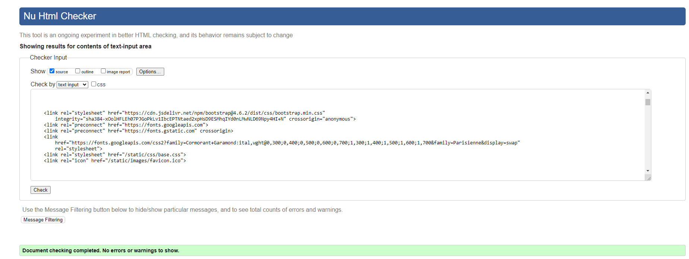
| <mark>PASS</mark> |
| About Page                                 |

About Page
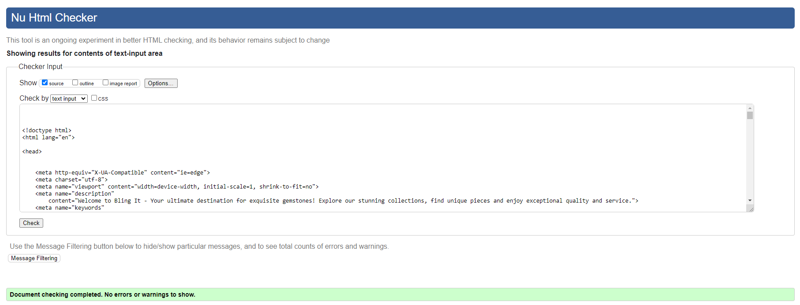
| <mark>PASS</mark> |
| All Gemstones Page                         |

All Gemstones Page
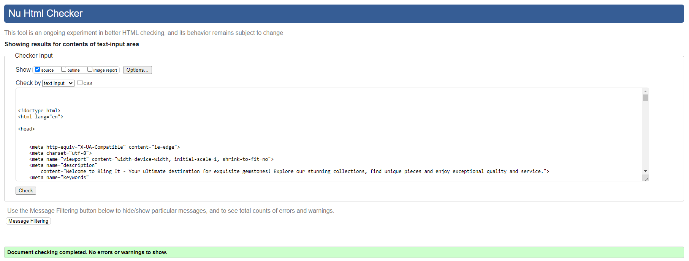
| <mark>PASS</mark> |
| Gemstones Detail Page                      |

Gemstones Detail Page
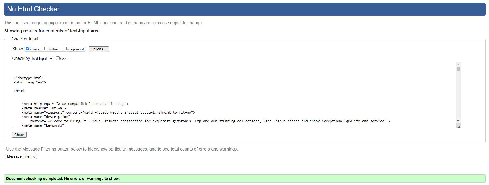
| <mark>PASS</mark> |
| Reviews Page                               |

Reviews Page

| <mark></mark> |
| Contact Page                               |

Contact Page

| <mark>PASS</mark> |
| FAQ Page                                   |

FAQ Page
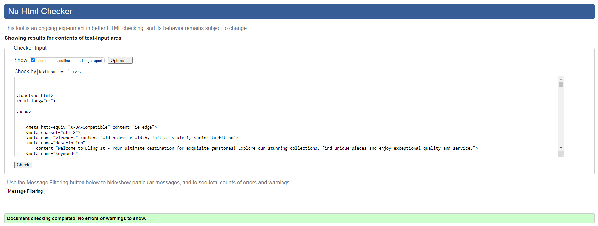
| <mark>PASS</mark> |
| Privacy Policy Page                        |

Privacy Policy Page

| <mark>PASS</mark> |
| Bag Page                                   |

Bag Page
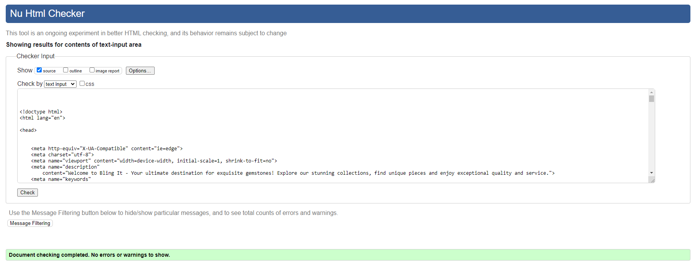
| <mark>PASS</mark> |
| Checkout Page                              |

Checkout Page

| <mark>PASS</mark> |
| Checkout Success Page                      |

Checkout Success Page
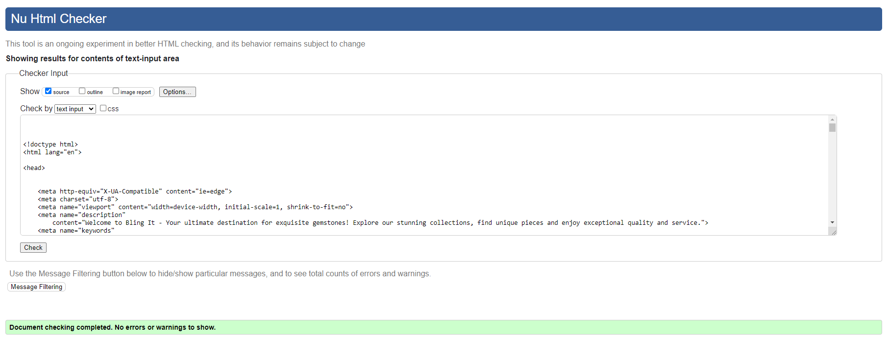
| <mark>PASS</mark> |
| Profile Page                               |

Profile Page
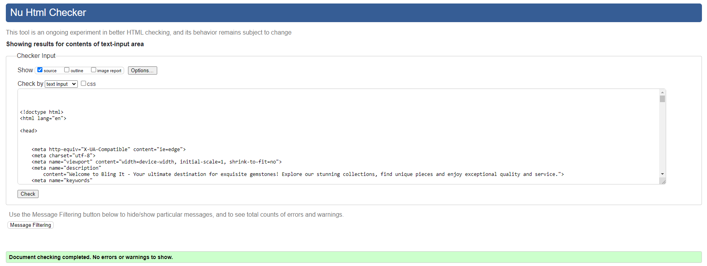
| <mark>PASS</mark> |
| Login Page                                 |

Login Page

| <mark>PASS</mark> |
| Logout Page                                |

Logout Page

| <mark>PASS</mark> |
| Error 403 Page                             |

Error 403 Page
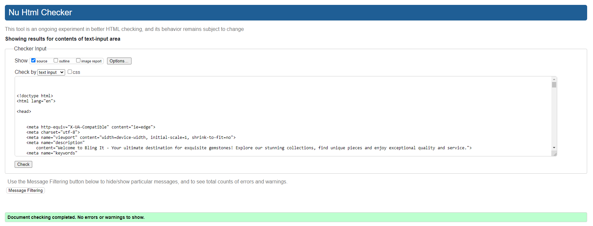
| <mark>PASS</mark> |
| Error 404 Page                             |

Error 404 Page
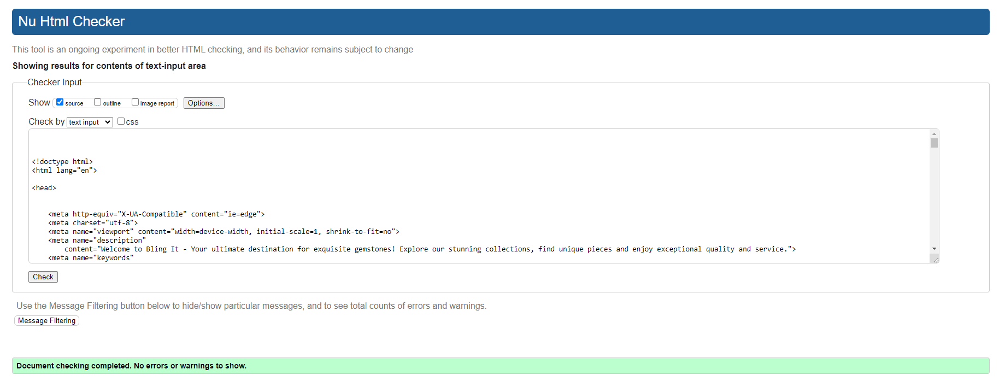
| <mark>PASS</mark> |

### **CSS**

All CSS pages were validated using [W3C CSS Validator](https://jigsaw.w3.org/css-validator/)

|   PAGE                                     |  VALIDATOR SCREENSHOT                                     |   RESULT    |
|--------------------------------------------|-----------------------------------------------------------|-------------|
| Base.css                                   |

Base.css
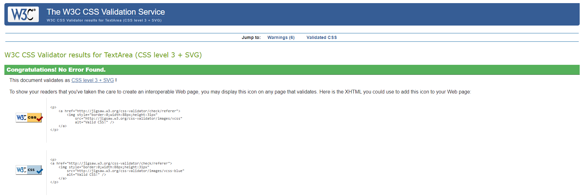
| <mark>PASS</mark> |
| Checkout.css                               |

Checkout.css
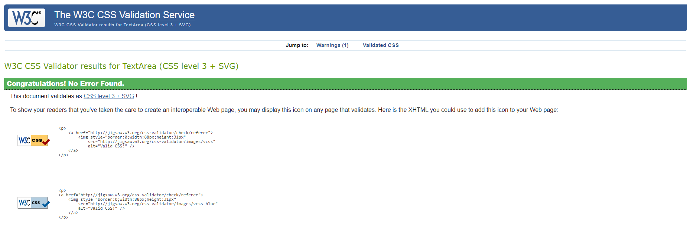
| <mark>PASS</mark> |
| Profile.css                                |

Profile.css
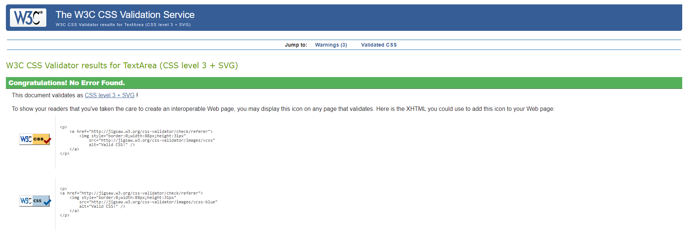
| <mark>PASS</mark> |

### **JavaScript**

### **Python**

| FILE    | VALIDATOR SCREENSHOT                                                                                                    | RESULT            |
| -------- | ---------------------------------------------------------------------------------------------------------------------- | ----------------- |
| Models   | 

Models

     | <mark></mark> |
| Views    | 

Views

       | <mark></mark> |
| Forms    | 

Forms

       | <mark></mark> |
| Urls     | 

Urls

      | <mark></mark> |
| Admin    | 

Admin

       | <mark></mark> |
| Settings | 

Settings

 | <mark></mark> |

## **Browser Testing**

The website was tested on Google Chrome, Firefox and Microsoft Edge browsers.

## **Device Testing**

The website was tested on various devices using Chrome DevTools and real-life device, such as iPhone 12, Samsung Galaxy S23, Lenovo X1 Carbon laptop and iPad Air.

## **Lighthouse**

| Page            | Performance | Accessibility | Best Practices | SEO | Screenshot                                                                                                                  |
| --------------- | --------- | ----------- | ------------ | - | --------------------------------------------------------------------------------------------------------------------------- |
| ***Desktop***     |             |               |                |     |
| Home            |           |            |             |  | 

Home

 |
|                 |             |               |                |     |

 

| Page            | Performance | Accessibility | Best Practices | SEO | Screenshot                                                                                                                  |
| --------------- | --------- | ----------- | ------------ | - | --------------------------------------------------------------------------------------------------------------------------- |
| ***Mobile***     |             |               |                |     |
| Home            |           |            |             |  | 

Home

 |
|                 |             |               |                |     |

## **Manual Testing**

### **Navigation**

| Element                | Action      | Expected Result                                         | Pass/Fail         |
| ---------------------- | ----------- | ------------------------------------------------------- | ----------------- |
| Logo                   | Click       | Redirect to Home page                                   | <mark></mark> |
| Home Link              | Click       | Redirect to Home page                                   |  |
| Register Link          | Click       | Redirect to sign up page                                |  |
| Log in Link            | Click       | Redirect to sign in page                                |  |
| Log out Link           | Click       | Redirect to log out page                                |  |
| Hamburger Menu         | Click       | Render a dropdown menu of all links                     |  |
| Footer Socials         | Click       | Redirect in a new tab to all respective media platforms |  |
| Footer Email           | Click       | Open up an email provider with developer email attached |  |
| Register Link          | Display     | Render for non authenticated users                      |  |
| Log in Link            | Display     | Render for non authenticated users                      |  |
| Log out Link           | Display     | Render only if user is authenticated                    |  |

### Home Page

| Element            | Action      | Expected Result                          | Pass/Fail         |
| ------------------ | ----------- | ---------------------------------------- | ----------------- |
| Book a Tour button | Click       | Redirect to Book a Tour page             | <mark></mark> |

### About Page

| Element            | Action      | Expected Result                          | Pass/Fail         |
| ------------------ | ----------- | ---------------------------------------- | ----------------- |
| Book a Tour button | Click       | Redirect to Book a Tour page             | <mark></mark> |

### Contact Page

| Element            | Action      | Expected Result                          | Pass/Fail         |
| ------------------ | ----------- | ---------------------------------------- | ----------------- |
| Book a Tour button | Click       | Redirect to Book a Tour page             | <mark></mark> |

### Delete Confirmation Modal

| Element               | Action      | Expected Result                       | Pass/Fail         |
| --------------------- | ----------- | ------------------------------------- | ----------------- |
| Close Button          | Click       | Modal and opacic background disappear | <mark></mark> |
| Confirm Delete Button | Click       | Context item is delete from database  |  |
| Close Button          | Hover/Focus | Darken Background                     |  |
| Confirm Delete Button | Hover/Focus | Darken Background                     |  |

### Sign Up Page

| Element       | Action         | Expected Result                             | Pass/Fail         |
| ------------- | -------------- | ------------------------------------------- | ----------------- |
| Page          | Authentication | Authenticated users redirected to Home page | <mark></mark> |
| Form(Valid)   | Submit         | Redirected to Home page                     |  |
| Form(Valid)   | Submit         | Sign up in Notification received            |  |
| Form(Invalid) | Submit         | Error Context rendered to UI                |  |
| Form(Invalid) | Submit         | Error Notification received                 |  |
| Login Link    | Click          | Redirect to Login Page                      |  |
| Form Button   | Hover/Focus    | Darken Background                           |  |
| Login Link    | Hover/Focus    | Darken Text                                 |  |

### Login Page

| Element       | Action         | Expected Result                             | Pass/Fail         |
| ------------- | -------------- | ------------------------------------------- | ----------------- |
| Page          | Authentication | Authenticated users redirected to Home page | <mark></mark> |
| Form(Valid)   | Submit         | Redirected to Home page                     |  |
| Form(Valid)   | Submit         | Sign up in Notification received            |  |
| Form(Invalid) | Submit         | Error Context rendered to UI                |  |
| Form(Invalid) | Submit         | Error Notification received                 |  |
| Register Link | Click          | Redirect to Sign Up Page                    |  |
| Form Button   | Hover/Focus    | Darken Background                           |  |
| Register Link | Hover/Focus    | Darken Text                                 |  |

### Log Out Page

| Element       | Action         | Expected Result                                | Pass/Fail         |
| ------------- | -------------- | ---------------------------------------------- | ----------------- |
| Page          | Authentication | Un-authenticated users redirected to Home page | <mark></mark> |
| Logout Button | Click          | User session is Logged out                     |  |
| Logout Button | Click          | Redirected to Home page                        |  |
| Form Button   | Hover/Focus    | Darken Background                              |  |

## **Responsiveness**

Responsiveness was achieved using Bootstrap and custom CSS and tested with Chrome DevTools making sure all pages adjust to screens starting from 320px wide.

## **Bugs & Fixes**

| Bug                                          | Cause                        | Solution                                                                              |
| -------------------------------------------- | ---------------------------- | ------------------------------------------------------------------------------------- |
| 

Non Nullable Field
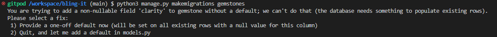
| Forgot to add default value to new field when modifying Gemstone model | Adding <code>default=''</code> to clarity field fixed the issue |
| 

Transparent Toast
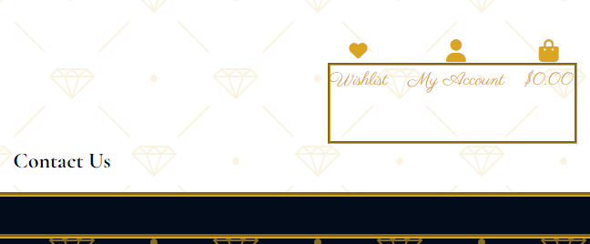
| No background color set | Added bg-white class |
| 

Footer Not Fixed
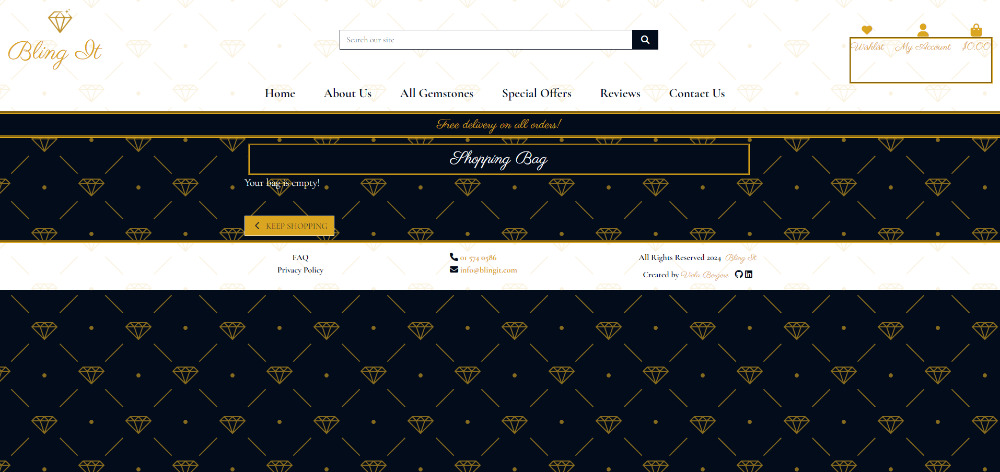
| 'fixed-bottom' class | Added 'sticky-bottom' class to footer and moved it outside wrapper |
| No error message displayed when user tries to add the same gemstone to shoppping bag | No message added to 'add_to_bag' view | Adjusting view with <code>messages.error(request, 'This gemstone is already in your shopping bag.')</code> |
| 

Decimal error
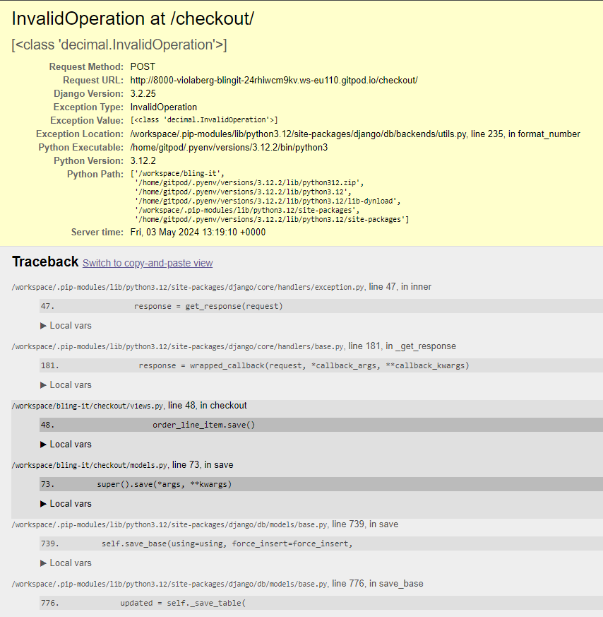
| Model OrderLineItem field <code>lineitem_total = models.DecimalField(max_digits=10, decimal_places=2, null=False, blank=False, editable=False)</code> max digits were set as 6, causing error as gemstone price was 20000.00 | Increasing max digits to 10 resolved the issue |
| 

Subscribtion Error
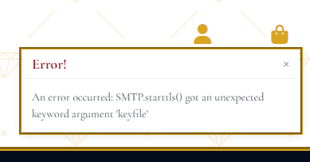
| Email verification for subscribtion letters | Newer version of Django installed and runtime.txt added to root |
| 

Test Error
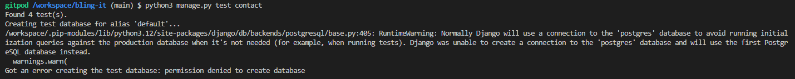
| Still connected to postgres | Commented out postgres in settings to use sqlite |
| 

Order not going through

| Incorrect url in checkout | Removed 'checkout' from url <code>path('cache_checkout_data/', views.cache_checkout_data, name='cache_checkout_data'),</code> |
| 

Order not going through
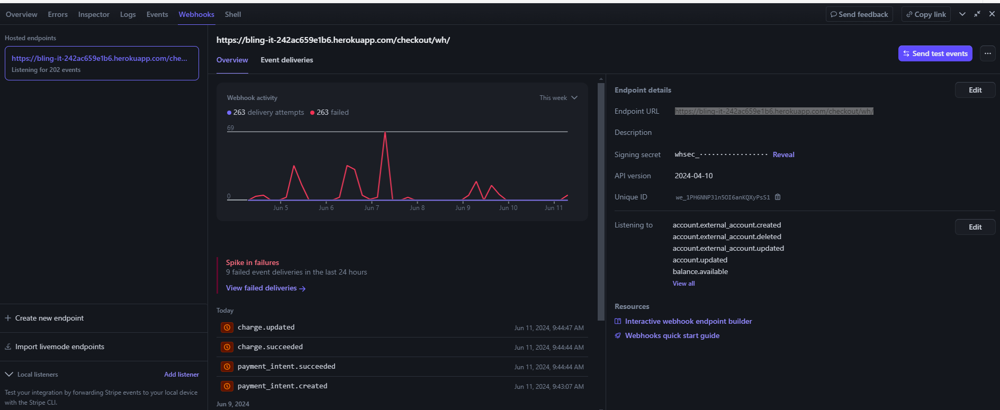
| Typo in webhooks.py | Replaced failed with succeeded 'checkout' from url <code>'payment_intent.succeeded': (
            handler.handle_payment_intent_succeeded
        ),</code> |

[Back to Readme](README.md)