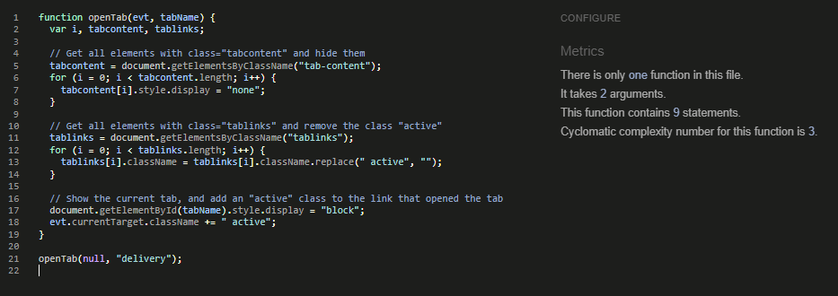
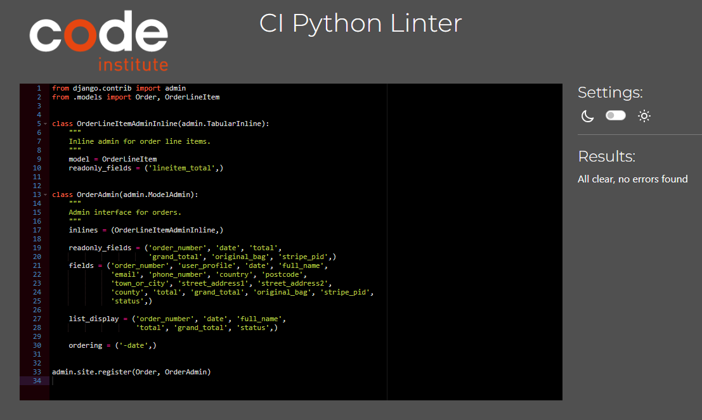
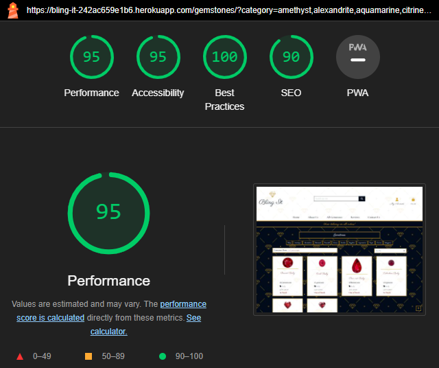
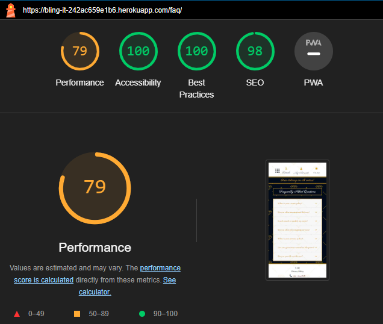

# **TESTING**

## **Table of Contents**
* [**User Story Testing**](#user-story-testing)
* [**Code Validation**](#code-validation)
    + [**HTML**](#html)
    + [**CSS**](#css)
    + [**JavaScript**](#javascript)
    + [**Python**](#python)
* [**Automated Testing**](#automated-testing)
* [**Browser Testing**](#browser-testing)
* [**Device Testing**](#device-testing)
* [**Lighthouse**](#lighthouse)
    + [**Desktop**](#desktop)
    + [**Mobile**](#mobile)
* [**Manual Testing**](#manual-testing)
    + [**Navigation**](#navigation)
    + [**Home Page**](#home-page)
    + [**All Gemstone Page**](#all-gemstones-page)
    + [**Gemstone's Detail Page**](#gemstones-detail-page)
    + [**Reviews Page**](#reviews-page)
    + [**Contact Page**](#contact-page)
    + [**FAQ Page**](#faq-page)
    + [**Privacy Policy Page**](#privacy-policy-page)
    + [**Sign Up Page**](#sign-up-page)
    + [**Login Page**](#login-page)
    + [**Log out Page**](#log-out-page)
    + [**Shopping Bag Page**](#shopping-bag-page)
    + [**Checkout Page**](#checkout-page)
    + [**Profile Page**](#profile-page)
    + [**Add Gemstone Page for Admin**](#add-gemstone-page-for-admin)
    + [**Edit Gemstone Page for Admin**](#log-out-page)
* [**Responsiveness**]()
* [**Bugs & Fixes**]()

## **User Story Testing**

For the following, I will leave out the type of user, ***As a developer/admin/user, I can…***, and only list the latter part of the story as a heading.

### **EPIC 1 - Planning:**

**...create wireframes so that I can clearly see the planned site layout** |passed |
|:---:|:---|
Wireframes created for desktop |✓|
Wireframes created for mobile |✓|
|||

**...choose fonts so that I can create a sophisticated site** |passed |
|:---:|:---|
Main, easy to read, Google font chosen |✓|
Heading and special text Google font chosen |✓|
Both fonts suit the style of app |✓|
|||

**...choose color palette and style of the site so that I can have a clear vision of end result** |passed |
|:---:|:---|
Colours chosen keeping in mind project style |✓|
Colours are pleasant to an eye and create a good contrast |✓|
Logo and background chosen to suit the style and colors |✓|
Color palette created once colors have been chosen |✓|
|||

**... create ERD so that I can clearly see my project's schema** |passed |
|:---:|:---|
ERD created and uploaded to project's folder |✓|
|||

### **EPIC 2 - Setup and Deployment:**

**...create Github repository so that I can store my project's files online** |passed |
|:---:|:---|
Github repository created |✓|
Kanban board using MoSCoW method created |✓|
Project set to Public |✓|
|||

**...create new workspace so that I can start working on project** |passed |
|:---:|:---|
Workspace on Gitpod using CI Gitpod full template created |✓|
Django installed |✓|
README, TESTING, DEPLOYMENT and AGILE |✓|
New Heroku app created and deployed early so to can confirm functionality |✓|
Databse connected |✓|
|||

**...design a responsive app so that I can ensure it's easy to use on any device** |passed |
|:---:|:---|
Project designed and developed with mobile first approach |✓|
Bootstrap and media queries used for responsiveness |✓|
|||

**... create user-friendly error pages so that I can guide user safely back to home page** |passed |
|:---:|:---|
403, 404, 500 error pages created |✓|
Customize to project's style |✓|
'Back to home page' button added |✓|
|||

### **EPIC 3 - Admin and Store Management:**

**...easily login so that I can update site when needed** |passed |
|:---:|:---|
Access to only authenticated admin |✓|
User friendly admin panel |✓|
|||

**...add a product so that I can add new items to store** |passed |
|:---:|:---|
User friendly form in admin panel to add products |✓|
|||

**...edit/ update a product so that I can change product prices, descriptions, images and other product criteria** |passed |
|:---:|:---|
User friendly form in admin panel to edit/ update products |✓|
|||

**... create ERD so that I can clearly see my project's schema** |passed |
|:---:|:---|
delete a product so that I can remove items that are no longer for sale |✓|
User friendly form on admin panel to delete a product |✓|
Alert message confirming deletion |left for future dev|
|||

### **EPIC 4 - Viewing and Navigating:**

**...view a list of products so that I can select some to purchase if I like** |passed |
|:---:|:---|
User friendly product list with images (or default image) and price |✓|
|||

**...check individual product detail page so that I can identify price, description, product image and any other additional information** |passed |
|:---:|:---|
User friendly product page created |✓|
Easy to read description written |✓|
All necessary information clearly visible |✓|
|||

**...choose a gemstone so that I can quickly find products I'm interested in and don't have to search through all** |passed |
|:---:|:---|
Option to choose a certain gemstone type |✓|
|||

**...easily view the total of my purchase at any time so that I can avoid spending too much** |passed |
|:---:|:---|
Clearly visible total at the top of the page beside cart icon |✓|
|||

**...add items I like to my wishlist so that I can find them easily if I decide to purchase later** |passed |
|:---:|:---|
Easily visible 'heart' for option to add item to wishlist |✓|
Wishlist accessible on top of the page |✓|
|||

### **EPIC 5 - Sorting and Searching:**

**...search for a product by name or a description so that I can find a specific product I'd like to purchase** |passed |
|:---:|:---|
Clearly visible search bar at the top of the page |✓|
|||

**...easily see what I've searched for and the number of results so that I can quickly see whether the product I want is available and decide if I want to purchase it** |passed |
|:---:|:---|
Clearly visible search results |✓|
|||

**...sort the list of available products so that I can easily identify the best priced products** |passed |
|:---:|:---|
Easy to sort items |✓|
Option to sort A-Z/ Z-A |✓|
By price |✓|
By carat size |✓|
|||

### **EPIC 6 - Registration and User Accounts:**

**...register on site so that I can save my personal information and wishlist** |passed |
|:---:|:---|
User friendly sign up form |✓|
User data stored and processed securely |✓|
Validation for user input |✓|
|||

**...login/ logout so that I can access my personal account information** |passed |
|:---:|:---|
User friendly form for login |✓|
Clearly visible logout button |✓|
Confirmation before and after logging out |✓|
|||

**...receive an email confirmation after registration so that I can verify that my account registration has been successful** |passed |
|:---:|:---|
Email confirmation sent successfully |✓|
|||

**...easily recover my password in case I forget it so that I can recover access to my account** |passed |
|:---:|:---|
Easily visible and user friendly way to recover password |✓|
|||

**...have a personalized user profile so that I can view my personal order history and order confirmation, and save my payment information** |passed |
|:---:|:---|
User friendly profile with personal information easily accessible |✓|
|||

### **EPIC 7 - Purchasing and Checkout:**

**...view items in my bag to be purchased so that I can identify the total cost of my purchase and all items I will receive** |passed |
|:---:|:---|
User friendly checkout bag |✓|
Clearly visible items in bag with prices beside each |✓|
Clearly visible total amount of purchase |✓|
|||

**...remove individual items from my bag so that I can easily make changes to my purchase before checkout** |passed |
|:---:|:---|
Easy to remove items before checkout |✓|
Immediate changes in bag after removal |✓|
|||

**...feel my personal and payment information is safe and secure so that I can confidently provide the needed information to make a purchase** |passed |
|:---:|:---|
All safety features implemented |✓|
|||

**...easily enter my payment information so that I can check out quickly and with no hassle** |passed |
|:---:|:---|
User friendly form to fill in payment details |✓|
Payment detail verification |✓|
|||

**... view an order confirmation after checkout so that I can verify that I haven't made any mistakes** |passed |
|:---:|:---|
Clearly visible order confirmation with items and total included |✓|
|||

**...receive an email confirmation after checking out so that I can keep the confirmation of what I've purchased for my records** |passed |
|:---:|:---|
Email sent successfully |✓|
|||

**...check my order status so that I can know when to expect it** |passed |
|:---:|:---|
Clearly visible order status in user profile |✓|
Order stages - In Progress, Delivered, Cancelled |✓|
|||

### **EPIC 8 - Contact:**

**...easily locate contact details so that I can contact shop if I need** |passed |
|:---:|:---|
Easily visible contact details in footer visible on every page |✓|
|||

**...contact someone at Bling It so that I can receive any additional information needed** |passed |
|:---:|:---|
Responsive and easy to use contact form with necessary fields |✓|
Site should prominently display contact information, including phone number, a contact form and/or email address |✓|
Email confirmation page after message has been sent successfully |✓|
|||

**...subscribe to newsletters so that I can receive the latest news, special offers and sales notifications** |passed |
|:---:|:---|
Clearly visible subscription form on home page |✓|
|||

### **EPIC 9 - FAQ and Privacy Policy:**

**...create/edit a list of FAQ so that I can offer users instant answers to their questions** |passed |
|:---:|:---|
User friendly option to write FAQ through admin panel |✓|
Option to edit questions |✓|
|||

**...read through FAQ so that I can find answers to my questions without contacting shop** |passed |
|:---:|:---|
Easy to locate FAQ page |✓|
Clearly written questions and answers |✓|
|||

**...read Privacy Policy so that I can see how my personal information, data will be used and what rights I have** |passed |
|:---:|:---|
Clearly written policy |✓|
Easy to access Policy page |✓|
|||

### **EPIC 10 - Reviews and Ratings:**

**...leave a review so that I can contribute to the community and help others to make informed decisions** |passed |
|:---:|:---|
The review submission form should include fields for the user to enter a title and written content |✓|
User friendly form |✓|
Character limit should be set |✓|
|||

**...leave a rating for the site so that I can let others know of my experience with shop** |passed |
|:---:|:---|
Clearly visible location to leave a rating for site |✓|
|||

**...delete review so that I can ensure appropriate content on app** |passed |
|:---:|:---|
Delete button/ link |✓|
Modal to confirm deletion |✓|
|||

## **Code Validation**

### **HTML**

All HTML pages were validated using [W3C HTML Validator](https://validator.w3.org/)

|   PAGE                                     |  VALIDATOR SCREENSHOT                                     |   RESULT    |
|--------------------------------------------|-----------------------------------------------------------|-------------|
| Home Page                                  |

Home Page

| <mark>PASS</mark> |
| About Page                                 |

About Page

| <mark>PASS</mark> |
| All Gemstones Page                         |

All Gemstones Page

| <mark>PASS</mark> |
| Gemstones Detail Page                      |

Gemstones Detail Page

| <mark>PASS</mark> |
| Reviews Page                               |

Reviews Page

| <mark></mark> |
| Contact Page                               |

Contact Page

| <mark>PASS</mark> |
| FAQ Page                                   |

FAQ Page

| <mark>PASS</mark> |
| Privacy Policy Page                        |

Privacy Policy Page

| <mark>PASS</mark> |
| Bag Page                                   |

Bag Page

| <mark>PASS</mark> |
| Checkout Page                              |

Checkout Page

| <mark>PASS</mark> |
| Checkout Success Page                      |

Checkout Success Page

| <mark>PASS</mark> |
| Profile Page                               |

Profile Page

| <mark>PASS</mark> |
| Login Page                                 |

Login Page

| <mark>PASS</mark> |
| Logout Page                                |

Logout Page

| <mark>PASS</mark> |
| Error 403 Page                             |

Error 403 Page

| <mark>PASS</mark> |
| Error 404 Page                             |

Error 404 Page

| <mark>PASS</mark> |

### **CSS**

All CSS pages were validated using [W3C CSS Validator](https://jigsaw.w3.org/css-validator/)

|   PAGE                                     |  VALIDATOR SCREENSHOT                                     |   RESULT    |
|--------------------------------------------|-----------------------------------------------------------|-------------|
| base.css                                   |

base.css

| <mark>PASS</mark> |
| checkout.css                               |

checkout.css

| <mark>PASS</mark> |
| profile.css                                |

profile.css

| <mark>PASS</mark> |

### **JavaScript**

All JavaScript was validated using (JS Hint)[https://jshint.com/]

|   PAGE                                     |  VALIDATOR SCREENSHOT                                     |   RESULT    |
|--------------------------------------------|-----------------------------------------------------------|-------------|
| gemstones.html                             |

gemstones.html

| <mark>PASS</mark> |
| scroll-to-top btn                          |

reviews.html

| <mark>PASS</mark> |
| profile.js                                 |

profile.js

| <mark>PASS</mark> |

### **Python**

All Python was validated using (CI Python Linter)[https://pep8ci.herokuapp.com/]

| FILE     | VALIDATOR SCREENSHOT                                                                                    | RESULT            |
| -------- | ------------------------------------------------------------------------------------------------------- | ----------------- |
| ***blingit*** |
| views.py    | 

Views

 | <mark>PASS</mark> |
| urls.py     | 

Urls

 | <mark>PASS</mark> |
| settings.py | 

Settings

 | <mark>few errors but these can't be split for better functionality</mark> |
| ***home*** |
| models.py   | 

Models

 | <mark>PASS</mark> |
| views.py    | 

Views

 | <mark>PASS</mark> |
| forms.py    | 

Forms

 | <mark>PASS</mark> |
| urls.py     | 

Urls

 | <mark>PASS</mark> |
| admin.py    | 

Admin

 | <mark>PASS</mark> |
| apps.py     | 

Apps

 | <mark>PASS</mark> |
| tests.py    | 

Tests

 | <mark>PASS</mark> |
| ***bag*** |
| apps.py     | 

Models

 | <mark>PASS</mark> |
| views.py    | 

Views

 | <mark>PASS</mark> |
| contexts.py | 

Contexts

 | <mark>PASS</mark> |
| urls.py     | 

Urls

 | <mark>PASS</mark> |
| ***checkout*** |
| models.py   | 

Models

 | <mark>PASS</mark> |
| views.py    | 

Views

 | <mark>PASS</mark> |
| forms.py    | 

Forms

 | <mark>PASS</mark> |
| urls.py     | 

Urls

 | <mark>PASS</mark> |
| admin.py    | 

Admin

 | <mark>PASS</mark> |
| signals.py  | 

Signals

 | <mark>PASS</mark> |
| webhooks.py  | 

Webhook

 | <mark>PASS</mark> |
| webhook_handlers.py | 

Webhook Handler

 | <mark>PASS</mark> |
| ***contact*** |
| models.py   | 

Models

 | <mark>PASS</mark> |
| views.py    | 

Views

 | <mark>PASS</mark> |
| forms.py    | 

Forms

 | <mark>PASS</mark> |
| urls.py     | 

Urls

 | <mark>PASS</mark> |
| tests.py    | 

Tests

 | <mark>PASS</mark> |
| apps.py     | 

Apps

 | <mark>PASS</mark> |
| ***gemstones*** |
| models.py   | 

Models

 | <mark>PASS</mark> |
| views.py    | 

Views

 | <mark>PASS</mark> |
| forms.py    | 

Forms

 | <mark>PASS</mark> |
| urls.py     | 

Urls

 | <mark>PASS</mark> |
| admin.py    | 

Admin

 | <mark>PASS</mark> |
| widgets.py  | 

Widgets

 | <mark>PASS</mark> |
| apps.py     | 

Apps

 | <mark>PASS</mark> |
| ***profiles*** |
| models.py   | 

Models

 | <mark>PASS</mark> |
| views.py    | 

Views

 | <mark>PASS</mark> |
| forms.py    | 

Forms

 | <mark>PASS</mark> |
| urls.py     | 

Urls

 | <mark>PASS</mark> |
| apps.py     | 

Apps

 | <mark>PASS</mark> |
| ***reviews*** |
| models.py   | 

Models

 | <mark>PASS</mark> |
| views.py    | 

Views

 | <mark>PASS</mark> |
| forms.py    | 

Forms

 | <mark>PASS</mark> |
| urls.py     | 

Urls

 | <mark>PASS</mark> |
| admin.py    | 

Admin

 | <mark>PASS</mark> |
| apps.py     | 

Apps

 | <mark>PASS</mark> |
| tests.py    | 

Tests

 | <mark>PASS</mark> |
|  |  |  |

## **Automated Testing**

Some automated testing was done alongside manual and results can be found below:

* Home app 
    
* Contact app 
    
* Reviews app 
    

## **Browser Testing**

The website was tested on Google Chrome, Firefox and Microsoft Edge browsers.

## **Device Testing**

The website was tested on various devices using Chrome DevTools and real-life device, such as iPhone 12, Samsung Galaxy S23, Lenovo X1 Carbon laptop and iPad Air.

## **Lighthouse**

# **Desktop**

| Home Desktop | 

Home Desktop

 |
| About Desktop | 

About Desktop

 |
| All Gemstones Desktop | 

All Gemstones Desktop

 |
| Gemstone Detail Desktop | 

Gemstone Detail Desktop

 |
| Reviews Desktop | 

Reviews Desktop

 |
| Contact Desktop | 

Contact Desktop

 |
| Profile Desktop | 

Profile Desktop

 |
| FAQ Desktop | 

FAQ Desktop

 |
| Privacy Policy Desktop | 

Privacy Policy Desktop

 |

# **Mobile**

| Home Mobile | 

Home Mobile

 |
| About Mobile | 

About Mobile

 |
| All Gemstones Mobile | 

All Gemstones Mobile

 |
| Gemstone Detail Mobile | 

Gemstone Detail Mobile

 |
| Reviews Mobile | 

Reviews Mobile

 |
| Contact Mobile | 

Contact Mobile

 |
| Profile Mobile | 

Profile Mobile

 |
| FAQ Mobile | 

FAQ Mobile

 |
| Privacy Policy Mobile | 

Privacy Policy Mobile

 |

## **Manual Testing**

### **Navigation**

| Element                | Action      | Expected Result                                         | Pass/Fail         |
| ---------------------- | ----------- | ------------------------------------------------------- | ----------------- |
| Logo                   | Click       | Redirect to Home page                                   | <mark>PASS</mark> |
| Home Link              | Click       | Redirect to Home page                                   | <mark>PASS</mark> |
| Register Link          | Click       | Redirect to sign up page                                | <mark>PASS</mark> |
| Log in Link            | Click       | Redirect to sign in page                                | <mark>PASS</mark> |
| Log out Link           | Click       | Redirect to log out page                                | <mark>PASS</mark> |
| Chocolate Menu         | Click       | Render a dropdown menu of all links                     | <mark>PASS</mark> |
| Footer Socials         | Click       | Redirect in a new tab to all respective media platforms | <mark>PASS</mark> |
| Footer Privacy Policy Link | Click   | Redirect to Priavcy Policy page                         | <mark>PASS</mark> |
| Footer FAQ Link        | Click       | Redirect to FAQ page                                    | <mark>PASS</mark> |
| Register Link          | Display     | Render for non authenticated users                      | <mark>PASS</mark> |
| Log in Link            | Display     | Render for non authenticated users                      | <mark>PASS</mark> |
| Log out Link           | Display     | Render only if user is authenticated                    | <mark>PASS</mark> |

### Home Page

| Element            | Action      | Expected Result                          | Pass/Fail         |
| ------------------ | ----------- | ---------------------------------------- | ----------------- |
| Shop Now button    | Click       | Redirect to All Gesmtones page           | <mark>PASS</mark> |
| Subscribe button   | Click       | Submit request for newsletter subscription | <mark>PASS</mark> |
| Subscribe form     | Enter email | Sign up for newsletter                   | <mark>PASS</mark> |

### All Gemstones Page

| Element            | Action      | Expected Result                          | Pass/Fail         |
| ------------------ | ----------- | ---------------------------------------- | ----------------- |
| Category Badges    | Click       | Sorts through categories leaving selected one | <mark>PASS</mark> |
| Pagination         | Click       | Redirects to the appropriate page        | <mark>PASS</mark> |
| Sorting            | Click       | Sorting method returns the correct results when element selected | <mark>PASS</mark> |
| Gemstones Home Link | Click      | Redirects back All Gemstones page        | <mark>PASS</mark> |
| Scroll to Top button | Click        | Scrolls page to top | <mark>PASS</mark> |

### Gemstone's Detail Page

| Element            | Action      | Expected Result                          | Pass/Fail         |
| ------------------ | ----------- | ---------------------------------------- | ----------------- |
| Add to Bag button  | Click       | Gemstone added to shopping bag           | <mark>PASS</mark> |
| Keep Shopping button | Click     | Redirects back All Gemstones page         | <mark>PASS</mark> |
| Wishlist heart icon | Click      | User logged in: Adds gemstone to user's wishlist | <mark>PASS</mark> |
| Wishlist heart icon | Click      | User not logged in: Redirect to login page | <mark>PASS</mark> |

### Reviews Page

| Element            | Action      | Expected Result                          | Pass/Fail         |
| ------------------ | ----------- | ---------------------------------------- | ----------------- |
| Review Form | Click        | Takes in neccessary review info and submits    | <mark>PASS</mark> |
| Submit button | Click       | Submit review form            | <mark>PASS</mark> |
| Delete review Link | Click        | If user logged in as admin, deletes review | <mark>PASS</mark> |
| Pagination         | Click       | Redirects to the appropriate page        | <mark>PASS</mark> |
| Scroll to Top button | Click        | Scrolls page to top | <mark>PASS</mark> |

### Contact Page

| Element            | Action      | Expected Result                          | Pass/Fail         |
| ------------------ | ----------- | ---------------------------------------- | ----------------- |
| Contact Form | Click        | Sends requested contact message to Bling It    | <mark>PASS</mark> |
| Contact Form | Click        | Once submitted, sends confirmation email to user | <mark>PASS</mark> |
| Submit button | Click       | Submit contact form            | <mark>PASS</mark> |

### FAQ Page

| Element            | Action      | Expected Result                          | Pass/Fail         |
| ------------------ | ----------- | ---------------------------------------- | ----------------- |
| Collapsable question header | Click        | Toggles open/ close answers for each question | <mark>PASS</mark> |

### Privacy Policy Page

| Element            | Action      | Expected Result                          | Pass/Fail         |
| ------------------ | ----------- | ---------------------------------------- | ----------------- |
| Scroll to Top button | Click        | Scrolls page to top | <mark>PASS</mark> |

### Sign Up Page

| Element       | Action         | Expected Result                             | Pass/Fail         |
| ------------- | -------------- | ------------------------------------------- | ----------------- |
| Form(Valid)   | Submit         | Redirects to Verify Your E-mail Address page | <mark>PASS</mark> |
| Form(Valid)   | Submit         | Sign up in Notification received            | <mark>PASS</mark> |
| Form(Invalid) | Submit         | Error Context rendered to UI                | <mark>PASS</mark> |
| Form(Invalid) | Submit         | Error Notification received                 | <mark>PASS</mark> |
| Login Link    | Click          | Redirect to Login Page                      | <mark>PASS</mark> |
| Sign up button | Hover/Focus   | Darken Background                           | <mark>PASS</mark> |
| Sign up button | Click         | Submits the form                            | <mark>PASS</mark> |
| Login Link    | Hover/Focus    | Darken Text                                 | <mark>PASS</mark> |

### Login Page

| Element       | Action         | Expected Result                             | Pass/Fail         |
| ------------- | -------------- | ------------------------------------------- | ----------------- |
| Form(Valid)   | Submit         | Redirected to Home page                     | <mark>PASS</mark> |
| Form(Valid)   | Submit         | Sign up in Notification received            | <mark>PASS</mark> |
| Form(Invalid) | Submit         | Error Context rendered to UI                | <mark>PASS</mark> |
| Form(Invalid) | Submit         | Error Notification received                 | <mark>PASS</mark> |
| Register Link | Click          | Redirect to Sign Up Page                    | <mark>PASS</mark> |
| Register Link | Hover/Focus    | Darkens Text                                | <mark>PASS</mark> |
| Log in button | Hover/Focus    | Darkens Background                          | <mark>PASS</mark> |
| Log in button | Click          | Submits the form                            | <mark>PASS</mark> |

### Log Out Page

| Element       | Action         | Expected Result                                | Pass/Fail         |
| ------------- | -------------- | ---------------------------------------------- | ----------------- |
| Logout Button | Click          | User session is Logged out                     | <mark>PASS</mark> |
| Logout Button | Click          | Redirected to Home page                        | <mark>PASS</mark> |
| Logout Button | Hover/Focus    | Darkens Background                             | <mark>PASS</mark> |

### Shopping Bag Page

| Element       | Action         | Expected Result                                | Pass/Fail         |
| ------------- | -------------- | ---------------------------------------------- | ----------------- |
| Secure Checkout button | Click | Brings to CHeckout page                        | <mark>PASS</mark> |
| Keep Shopping button | Click   | Redirects back All Gemstones page              | <mark>PASS</mark> |
| Remove Link | Click            | Removes gemstone from shoppping bag            | <mark>PASS</mark> |

### Checkout Page

| Element       | Action         | Expected Result                                | Pass/Fail         |
| ------------- | -------------- | ---------------------------------------------- | ----------------- |
| Checkout Form | Fill out the form and click Complete Order button | Securely comppletes Order using Stripe | <mark>PASS</mark> |
| Adjust Bag button | Click          | Redirected to Home page                        | <mark>PASS</mark> |
| Adjust Bag button | Hover/Focus  | Lightens Background                       | <mark>PASS</mark> |
| Complete Order button | Hover/Focus    | Darkens Background                              | <mark>PASS</mark> |
| Complete Order button | Click    | Securely completes order and brings to success page | <mark>PASS</mark> |

### Profile Page

| Element       | Action         | Expected Result                                | Pass/Fail         |
| ------------- | -------------- | ---------------------------------------------- | ----------------- |
| Delivery Info Form | Change details | Details updated | <mark>PASS</mark> |
| Orders Tab | Hover | Opens wishlist | <mark>PASS</mark> |
| Delivery Info Tab | Hover | Opens wishlist | <mark>PASS</mark> |
| Wishlist Tab | Hover | Opens wishlist | <mark>PASS</mark> |
| Remove Link | Click | Removes gemstone from shoppping bag and redirects to gemstone detail page | <mark>PASS</mark> |

### Add Gemstone Page for Admin

| Element       | Action         | Expected Result                                | Pass/Fail         |
| ------------- | -------------- | ---------------------------------------------- | ----------------- |
| Add Gemstone Form | Fill in form, add image and click on Add Product button | Adds new gemstone to shop with image | <mark>PASS</mark> |
| Add Gemstone Form | Fill in form, don't image and click on Add Product button | Adds new gemstone to shop with image placeholder | <mark>PASS</mark> |
| Cancel button | Click | Cancels gemstone addition | <mark>PASS</mark> |
| Add Gemstone button | Click | Submits add gemstone form | <mark>PASS</mark> |
| Select Image button | Click | Opens window to choose image | <mark>PASS</mark> |

### Edit Gemstone Page for Admin

| Element       | Action         | Expected Result                                | Pass/Fail         |
| ------------- | -------------- | ---------------------------------------------- | ----------------- |
| Edit Gemstone Form | Fill in form, change details and click on Edit Product button | Edits gemstone | <mark>PASS</mark> |
| Cancel button | Click | Cancels gemstone addition | <mark>PASS</mark> |
| Edit Gemstone button | Click | Submits edit gemstone form | <mark>PASS</mark> |

## **Responsiveness**

Responsiveness was achieved using Bootstrap and custom CSS and tested with Chrome DevTools making sure all pages adjust to screens starting from 320px wide.

## **Bugs & Fixes**

| Bug                                          | Cause                        | Solution                                                                              |
| -------------------------------------------- | ---------------------------- | ------------------------------------------------------------------------------------- |
| 

Non Nullable Field

| Forgot to add default value to new field when modifying Gemstone model | Adding <code>default=''</code> to clarity field fixed the issue |
| 

Transparent Toast

| No background color set | Added bg-white class |
| 

Footer Not Fixed

| 'fixed-bottom' class | Added 'sticky-bottom' class to footer and moved it outside wrapper |
| No error message displayed when user tries to add the same gemstone to shoppping bag | No message added to 'add_to_bag' view | Adjusting view with <code>messages.error(request, 'This gemstone is already in your shopping bag.')</code> |
| 

Decimal error

| Model OrderLineItem field <code>lineitem_total = models.DecimalField(max_digits=10, decimal_places=2, null=False, blank=False, editable=False)</code> max digits were set as 6, causing error as gemstone price was 20000.00 | Increasing max digits to 10 resolved the issue |
| 

Subscribtion Error

| Email verification for subscribtion letters | Newer version of Django installed and runtime.txt added to root |
| 

Test Error

| Still connected to postgres | Commented out postgres in settings to use sqlite |
| 

Order not going through

| Incorrect url in checkout | Removed 'checkout' from url <code>path('cache_checkout_data/', views.cache_checkout_data, name='cache_checkout_data'),</code> |
| 

Order not going through

| Typo in webhooks.py | Replaced failed with succeeded 'checkout' from url <code>'payment_intent.succeeded': (
            handler.handle_payment_intent_succeeded
        ),</code> |

[Back to Readme](README.md)